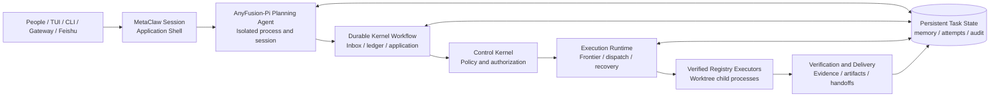

<p align="center">
  <a href="https://anyint.ai/"></a>
  
  <a href="https://www.metafusion.cc/"></a>
</p>

<div align="center">

# AnyFusion

**AI Task Control Plane for Durable, Governed Agent Workflows**

Turn long-running enterprise work into persistent, policy-governed task graphs executed by specialized agents.

<strong>AnyFusion is a strategic open-source initiative backed by AnyInt and MetaFusion. It is currently deployed for limited internal pilot use.</strong><br /><br />
[](docs/releases/v1.2.0-preview.0.md)
[](docs/releases/v1.2.0-preview.0.md#current-deployment-status)
[](https://github.com/MetaAny/AnyFusion/actions/workflows/ci.yml)
[](#license)

[Overview](#an-operating-system-for-long-running-agent-work) · [Capabilities](#core-capabilities) · [How It Works](#how-it-works) · [Quick Start](#quick-start) · [Status](#project-status) · [中文](README.zh-CN.md)

</div>

## An operating system for long-running agent work

Most agent tools optimize a single interactive session. Enterprise work is different: it can span hours or days, cross repositories and business domains, depend on several specialist agents, pause on missing inputs, and still need a controlled path to completion.

AnyFusion is a local-first task control plane between people, business surfaces, and agent runtimes. It preserves the objective and execution state, decomposes complex work into a dependency-aware graph, routes each unit to an appropriate agent class, governs every state-changing decision, and records the evidence required to resume, verify, and deliver the result.

It is designed for workflows where continuity, control, and accountability matter more than producing one more chat response.

## Core Capabilities

| Capability | What it provides |
| --- | --- |
| **Durable task scheduling** | Persistent task and subtask lifecycles, dependency readiness, blocking, parking, resumption, cancellation, and recovery across process or session boundaries. |
| **Policy-governed planning** | Natural-language planning is separated from authorization: the Planner proposes, the Control Kernel decides, and the Runtime applies only approved side effects. |
| **Dependency-aware work graphs** | Complex objectives become explicit DAGs with acceptance criteria, typed dependencies, scoped context, and durable handoff contracts between work units. |
| **Specialized-agent orchestration** | Controlled Capability routing maps each Subtask to the complete eligible set from one verified, digest-bound Executor Registry snapshot, including Codex, Pi, Hermes profiles, or organization-specific session CLIs. |
| **Worktree execution** | Verified registry-bound CLI Executors run as short-lived child processes in persistent private Git worktrees; Docker packages the one Ubuntu Runtime but does not dispatch individual attempts. |
| **Verification and accountability** | Structured completion contracts capture acceptance evidence, artifacts, handoffs, attempt receipts, and audit events before results are exposed or delivered. |
| **Operational memory and delivery** | Explicitly confirmed preferences, deterministic task search, terminal workflows, Gateway surfaces, and Feishu delivery remain connected to the same durable task state. |

## Built for complex enterprise workflows

AnyFusion is intended to coordinate long-running work that crosses specialist boundaries, for example:

- **Engineering delivery:** planning, implementation, test execution, review, documentation, and artifact delivery across dedicated engineering agents.
- **Research and analysis:** source collection, domain-specific analysis, evidence review, synthesis, and report generation with explicit dependency handoffs.
- **Business operations:** intake from enterprise messaging, controlled specialist processing, human clarification when required, verification, and final delivery through the original channel.

The executor layer is adapter-based, so organizations can register vertical agents while keeping task state, routing facts, policy decisions, and completion evidence under one control plane.

## How It Works



Three boundaries keep the workflow governable:

1. **The Planner proposes; it never grants itself execution authority.**
2. **The Control Kernel makes deterministic policy decisions from explicit runtime facts.**
3. **The Runtime executes scoped decisions and reports normalized outcomes for the next decision.**

Work graphs model independent branches, specialist assignments, and typed dependency delivery. The durable Kernel workflow serializes authorization and application, while up to four independent attempts inside the one active top-level Task may run concurrently. Resource partitioning, durable leases, persistent workspaces, short-lived Executor processes, deterministic Git publication, crash recovery, and event-driven Executor error recovery are active.

## Quick Start

### Native Linux server

The supported server path runs AnyFusion, the sibling AnyFusion-Pi Planner,
Codex, and Pi directly as host processes. Executor attempts use isolated
temporary Agent homes and managed Git worktrees. Docker is not required for
local startup or smoke.

1. Install Node.js 22.19+, npm, Git, Codex, and Pi. Keep both repositories next
to each other:

```bash
mkdir -p "$HOME/anyfusion-src"
cd "$HOME/anyfusion-src"

git clone https://github.com/MetaAny/AnyFusion.git
git clone --branch codex/anyfusion-planner \
  https://github.com/MetaAny/AnyFusion-Pi.git

cd "$HOME/anyfusion-src/AnyFusion"
```

2. Create the three provider files:

```bash
cp docker/planner-pi.env.example docker/planner-pi.env
cp docker/executor-codex.env.example docker/executor-codex.env
cp docker/executor-pi.env.example docker/executor-pi.env
```

Set `OPENAI_API_KEY` and `OPENAI_BASE_URL` in each file.

3. Install the launcher and validate the environment:

```bash
./setup.sh
anyfusion --check
anyfusion executor list
```

Confirm that each Executor intended for routing is `enabled / verified`. Use
`anyfusion executor discover`, `register`, and `verify` when a binding has not
yet been confirmed.

4. Start the TUI or run an end-to-end gate:

```bash
anyfusion --project /path/to/project
anyfusion smoke --scenario artifact
anyfusion smoke --executor pi --scenario pi-research --timeout 300
```

The launcher builds both repositories and uses only verified absolute CLI
bindings from `$ANYFUSION_CONFIG_HOME/executors.yaml`. Use
`anyfusion --no-build` to reuse current outputs. Runtime data is stored under
`~/.local/share/anyfusion/runtime`; the Registry and private Executor source
configuration are stored under `~/.config/anyfusion`. Docker provides the
unified Ubuntu Runtime/test environment and persistent Feishu Gateway used
from Windows.

### Windows-hosted Feishu Gateway

Windows runs Docker Desktop while Runtime, Planner and Executors stay inside
the same Ubuntu image. The Feishu app must have bot capability and the
`im.message.receive_v1` event configured for long-connection delivery. Keep
`AnyFusion` and `AnyFusion-Pi` side by side, then create the four mounted
credential files:

```powershell
Copy-Item docker\planner-pi.env.example docker\planner-pi.env
Copy-Item docker\executor-codex.env.example docker\executor-codex.env
Copy-Item docker\executor-pi.env.example docker\executor-pi.env
Copy-Item docker\feishu.env.example docker\feishu.env
```

Set the provider credentials and Feishu `FEISHU_APP_ID` / `FEISHU_APP_SECRET`,
then build and start the persistent Gateway:

```powershell
.\docker\gateway.ps1 -Rebuild
.\docker\gateway.ps1 -Status
.\docker\gateway.ps1 -Logs
```

The `anyfusion-gateway` container uses `unless-stopped`, publishes no inbound
port, and reuses its data and Project volumes across rebuilds. Subsequent source
updates need only `-Rebuild`. Use `docker\shell.ps1` separately when an
interactive SSH/TUI development container is required.

## Project Status

| Area | Current state |
| --- | --- |
| Release | `v1.2.0-preview.0` |
| Maturity | Developer Preview |
| Deployment | Limited internal pilot use |
| Task scope | One active top-level task with dependency-aware subtasks |
| Dispatch | Deterministic batches with up to four concurrent isolated attempts inside the active top-level Task |
| Persistence | Fresh-only SQLite schema 34; schema 33 and older databases are rejected without migration or automatic deletion |
| Executor authority | Digest-bound host Registry; only enabled, verified, digest-matched bindings are routable |
| Compatibility | CLI, configuration, and runtime contracts may evolve before a stable release |

AnyFusion is not presented as Production Ready. The preview is intended to validate the task control plane, work-graph contracts, specialist routing, verification model, and operational workflow before stable compatibility commitments are made.

## Documentation

| Resource | Purpose |
| --- | --- |
| [Technical Overview](docs/current/technical-overview.md) | Runtime architecture, operational setup, modules, and implementation details |
| [Runtime Security](docs/current/phase-5-runtime-security.md) | Worktree Executor processes, persistent workspaces, Registry bindings, PID cleanup, and runtime elevation |
| [Architecture Decisions](docs/adr/README.md) | Accepted boundaries and authoritative design decisions |
| [Concurrency Roadmap](docs/plans/2026-07-16-planner-kernel-concurrency-convergence-roadmap.md) | Control-plane, resource-partitioning, recovery, and parallel scheduling plan |
| [Preview Release Notes](docs/releases/v1.2.0-preview.0.md) | Current release scope, deployment status, and known limitations |
| [Changelog](CHANGELOG.md) | Versioned lifecycle and notable changes |
| [Documentation Map](docs/README.md) | Index of current, historical, and contributor-facing documentation |

## License

AnyFusion is licensed under the [Apache License, Version 2.0](LICENSE).

Copyright 2026 The AnyFusion Contributors.

<p align="center"><sub>Hosted by MetaAny as a neutral open-source home.</sub></p>
