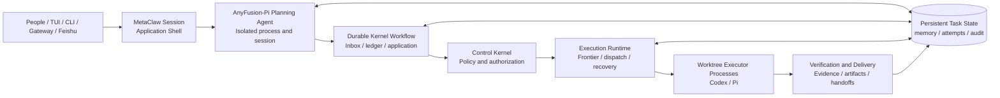

<p align="center">
  <a href="https://anyint.ai/"></a>
  
  <a href="https://www.metafusion.cc/"></a>
</p>

<div align="center">

# AnyFusion

**AI Task Control Plane for Durable, Governed Agent Workflows**

Turn long-running enterprise work into persistent, policy-governed task graphs executed by specialized agents.

<strong>AnyFusion is a strategic open-source initiative backed by AnyInt and MetaFusion. It is currently deployed for limited internal pilot use.</strong><br /><br />
[](docs/releases/v1.2.0-preview.0.md)
[](docs/releases/v1.2.0-preview.0.md#current-deployment-status)
[](https://github.com/MetaAny/AnyFusion/actions/workflows/ci.yml)
[](#license)

[Overview](#an-operating-system-for-long-running-agent-work) · [Capabilities](#core-capabilities) · [How It Works](#how-it-works) · [Quick Start](#quick-start) · [Status](#project-status) · [中文](README.zh-CN.md)

</div>

## An operating system for long-running agent work

Most agent tools optimize a single interactive session. Enterprise work is different: it can span hours or days, cross repositories and business domains, depend on several specialist agents, pause on missing inputs, and still need a controlled path to completion.

AnyFusion is a local-first task control plane between people, business surfaces, and agent runtimes. It preserves the objective and execution state, decomposes complex work into a dependency-aware graph, routes each unit to an appropriate agent class, governs every state-changing decision, and records the evidence required to resume, verify, and deliver the result.

It is designed for workflows where continuity, control, and accountability matter more than producing one more chat response.

## Core Capabilities

| Capability | What it provides |
| --- | --- |
| **Durable task scheduling** | Persistent task and subtask lifecycles, dependency readiness, blocking, parking, resumption, cancellation, and recovery across process or session boundaries. |
| **Policy-governed planning** | Natural-language planning is separated from authorization: the Planner proposes, the Control Kernel decides, and the Runtime applies only approved side effects. |
| **Dependency-aware work graphs** | Complex objectives become explicit DAGs with acceptance criteria, typed dependencies, scoped context, and durable handoff contracts between work units. |
| **Specialized-agent orchestration** | Capability-based routing maps each subtask to ordered agent-class candidates such as Codex, Pi, Hermes, or organization-specific vertical agents without embedding routing policy in prompts. |
| **Worktree execution** | Canonical Codex and Pi attempts run as short-lived child processes in persistent private Git worktrees; the existing Docker attempt backend remains an explicit compatibility option. |
| **Verification and accountability** | Structured completion contracts capture acceptance evidence, artifacts, handoffs, attempt receipts, and audit events before results are exposed or delivered. |
| **Operational memory and delivery** | Explicitly confirmed preferences, deterministic task search, terminal workflows, Gateway surfaces, and Feishu delivery remain connected to the same durable task state. |

## Built for complex enterprise workflows

AnyFusion is intended to coordinate long-running work that crosses specialist boundaries, for example:

- **Engineering delivery:** planning, implementation, test execution, review, documentation, and artifact delivery across dedicated engineering agents.
- **Research and analysis:** source collection, domain-specific analysis, evidence review, synthesis, and report generation with explicit dependency handoffs.
- **Business operations:** intake from enterprise messaging, controlled specialist processing, human clarification when required, verification, and final delivery through the original channel.

The executor layer is adapter-based, so organizations can register vertical agents while keeping task state, routing facts, policy decisions, and completion evidence under one control plane.

## How It Works



Three boundaries keep the workflow governable:

1. **The Planner proposes; it never grants itself execution authority.**
2. **The Control Kernel makes deterministic policy decisions from explicit runtime facts.**
3. **The Runtime executes scoped decisions and reports normalized outcomes for the next decision.**

Work graphs model independent branches, specialist assignments, and typed dependency delivery. The durable Kernel workflow serializes authorization and application, while up to four independent attempts inside the one active top-level Task may run concurrently. Resource partitioning, durable leases, persistent workspaces, short-lived Executor processes, deterministic Git publication, crash recovery, and event-driven Executor error recovery are active.

## Quick Start

### Native macOS installation (no Docker)

The current Developer Preview runs natively on macOS with Node.js 22.19+.
Docker Desktop is not required. Executor attempts run as local child processes,
each with its own managed Git worktree.

The Planner is currently maintained in the separate AnyFusion-Pi fork and has
not yet been bundled into a single binary. The native preview therefore builds
both repositories once. Keep them next to each other as shown below.

1. Install the system prerequisites:

```bash
brew install node@22 git ripgrep fd python@3.12
export PATH="$(brew --prefix node@22)/bin:$PATH"
node --version # must be v22.19.0 or newer
```

2. Clone and build the Runtime and Planner:

```bash
mkdir -p "$HOME/anyfusion-src"
cd "$HOME/anyfusion-src"

git clone https://github.com/MetaAny/AnyFusion.git
git clone --branch codex/anyfusion-planner \
  https://github.com/MetaAny/AnyFusion-Pi.git

cd "$HOME/anyfusion-src/AnyFusion-Pi"
npm ci --ignore-scripts
npm run build:offline

cd "$HOME/anyfusion-src/AnyFusion"
npm ci
npm run build

# Canonical worktree Executors. The Planner uses the separately built fork above.
npm install -g --ignore-scripts \
  @openai/codex@0.144.1 \
  @earendil-works/pi-coding-agent@0.80.2
```

3. Create the native provider configuration. Replace the two placeholder
values before running these commands:

```bash
export ANYFUSION_PROVIDER_KEY='replace-with-your-key'
export ANYFUSION_PROVIDER_URL='https://your-openai-compatible-endpoint.example/v1'
export ANYFUSION_CONFIG_HOME="$HOME/.config/anyfusion"

mkdir -p \
  "$ANYFUSION_CONFIG_HOME/planner" \
  "$ANYFUSION_CONFIG_HOME/codex" \
  "$ANYFUSION_CONFIG_HOME/pi-home/.pi/agent" \
  "$HOME/.local/bin"

cat > "$ANYFUSION_CONFIG_HOME/provider.env" <<EOF
OPENAI_API_KEY=$ANYFUSION_PROVIDER_KEY
OPENAI_BASE_URL=$ANYFUSION_PROVIDER_URL
PI_SKIP_VERSION_CHECK=1
PI_TELEMETRY=0
EOF
chmod 600 "$ANYFUSION_CONFIG_HOME/provider.env"

cd "$HOME/anyfusion-src/AnyFusion"
sed "s|__OPENAI_BASE_URL__|$ANYFUSION_PROVIDER_URL|g" \
  docker/planner-pi-config/models.json \
  > "$ANYFUSION_CONFIG_HOME/planner/models.json"
cp docker/planner-pi-config/settings.json \
  "$ANYFUSION_CONFIG_HOME/planner/settings.json"

sed "s|__OPENAI_BASE_URL__|$ANYFUSION_PROVIDER_URL|g" \
  docker/codex-config/executor/config.toml \
  > "$ANYFUSION_CONFIG_HOME/codex/config.toml"

sed "s|__OPENAI_BASE_URL__|$ANYFUSION_PROVIDER_URL|g" \
  docker/pi-config/models.json \
  > "$ANYFUSION_CONFIG_HOME/pi-home/.pi/agent/models.json"
cp docker/pi-config/settings.json \
  "$ANYFUSION_CONFIG_HOME/pi-home/.pi/agent/settings.json"
```

4. Install a native launcher:

```bash
cat > "$HOME/.local/bin/anyfusion" <<'EOF'
#!/usr/bin/env bash
set -euo pipefail

ANYFUSION_SOURCE_ROOT="${ANYFUSION_SOURCE_ROOT:-$HOME/anyfusion-src/AnyFusion}"
ANYFUSION_PI_SOURCE_ROOT="${ANYFUSION_PI_SOURCE_ROOT:-$HOME/anyfusion-src/AnyFusion-Pi}"
ANYFUSION_CONFIG_HOME="${ANYFUSION_CONFIG_HOME:-$HOME/.config/anyfusion}"

export METACLAW_HOME="${METACLAW_HOME:-$HOME/.local/share/anyfusion}"
export METACLAW_EXECUTOR_BACKEND=worktree
export METACLAW_PLANNER_COMMAND="$ANYFUSION_PI_SOURCE_ROOT/packages/coding-agent/dist/cli.js"
export METACLAW_PLANNER_TUI_COMMAND="$METACLAW_PLANNER_COMMAND"
export METACLAW_PLANNER_WORKDIR="$PWD"
export METACLAW_PLANNER_HOME="$ANYFUSION_CONFIG_HOME/planner"
export ANYFUSION_PLANNER_HOME="$METACLAW_PLANNER_HOME"
export METACLAW_PLANNER_SESSION_DIR="$METACLAW_HOME/planner-sessions"
export METACLAW_PLANNER_SCHEMA_PATH="$ANYFUSION_SOURCE_ROOT/dist/planning-agent-plan-v7.schema.json"
export ANYFUSION_PLANNER_SCHEMA_PATH="$METACLAW_PLANNER_SCHEMA_PATH"
export METACLAW_PLANNER_ENV_FILE="$ANYFUSION_CONFIG_HOME/provider.env"
export METACLAW_CODEX_EXECUTOR_ENV_FILE="$ANYFUSION_CONFIG_HOME/provider.env"
export METACLAW_PI_EXECUTOR_ENV_FILE="$ANYFUSION_CONFIG_HOME/provider.env"
export METACLAW_EXECUTOR_CODEX_HOME="$ANYFUSION_CONFIG_HOME/codex"
export METACLAW_EXECUTOR_PI_HOME="$ANYFUSION_CONFIG_HOME/pi-home"
export METACLAW_PI_ATTEMPT_EXTENSION="$ANYFUSION_SOURCE_ROOT/dist/pi-attempt-tools.ts"
export PI_SKIP_VERSION_CHECK=1
export PI_TELEMETRY=0

exec node "$ANYFUSION_SOURCE_ROOT/dist/index.js" "$@"
EOF

chmod +x "$HOME/.local/bin/anyfusion"
grep -q 'HOME/.local/bin' "$HOME/.zshrc" 2>/dev/null \
  || echo 'export PATH="$HOME/.local/bin:$(brew --prefix node@22)/bin:$PATH"' >> "$HOME/.zshrc"
export PATH="$HOME/.local/bin:$(brew --prefix node@22)/bin:$PATH"
```

5. Open the repository or directory that AnyFusion should operate on, then
start the TUI:

```bash
cd /path/to/your/project
anyfusion
```

Runtime state is stored under `~/.local/share/anyfusion`. Executor changes are
made in managed Subtask worktrees and published through the existing Git
publication path. Do not set `METACLAW_EXECUTOR_BACKEND=docker` for the native
macOS installation.

After pulling changes later, rebuild both source trees with
`npm run build:offline` in AnyFusion-Pi and `npm run build` in AnyFusion.

Then give AnyFusion a multi-step objective in natural language:

```text
Analyze these contracts, assign legal and commercial review to the appropriate specialist agents, and deliver a consolidated risk matrix with supporting evidence.
```

AnyFusion classifies the request, creates a durable task when required, authorizes the work graph, dispatches ready work units, validates their completion contracts, and preserves the resulting evidence and artifacts. Run `npm run smoke:anyfusion` separately when credentials are available for a live end-to-end validation.

## Project Status

| Area | Current state |
| --- | --- |
| Release | `v1.2.0-preview.0` |
| Maturity | Developer Preview |
| Deployment | Limited internal pilot use |
| Task scope | One active top-level task with dependency-aware subtasks |
| Dispatch | Deterministic batches with up to four concurrent isolated attempts inside the active top-level Task |
| Compatibility | CLI, configuration, and runtime contracts may evolve before a stable release |

AnyFusion is not presented as Production Ready. The preview is intended to validate the task control plane, work-graph contracts, specialist routing, verification model, and operational workflow before stable compatibility commitments are made.

## Documentation

| Resource | Purpose |
| --- | --- |
| [Technical Overview](docs/current/technical-overview.md) | Runtime architecture, operational setup, modules, and implementation details |
| [Runtime Security](docs/current/phase-5-runtime-security.md) | Worktree Executor processes, Docker compatibility attempts, persistent workspaces, image profiles, and runtime elevation |
| [Architecture Decisions](docs/adr/README.md) | Accepted boundaries and authoritative design decisions |
| [Concurrency Roadmap](docs/plans/2026-07-16-planner-kernel-concurrency-convergence-roadmap.md) | Control-plane, resource-partitioning, recovery, and parallel scheduling plan |
| [Preview Release Notes](docs/releases/v1.2.0-preview.0.md) | Current release scope, deployment status, and known limitations |
| [Changelog](CHANGELOG.md) | Versioned lifecycle and notable changes |
| [Documentation Map](docs/README.md) | Index of current, historical, and contributor-facing documentation |

## License

AnyFusion is licensed under the [Apache License, Version 2.0](LICENSE).

Copyright 2026 The AnyFusion Contributors.

<p align="center"><sub>Hosted by MetaAny as a neutral open-source home.</sub></p>
