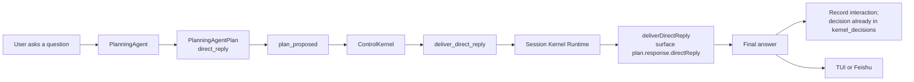
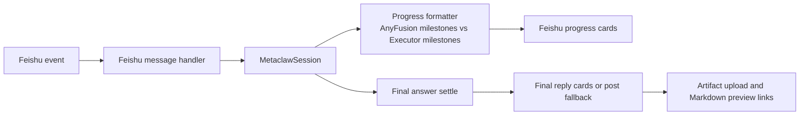

# AnyFusion

[English Home](../../README.md) | [中文技术总览](technical-overview.zh-CN.md)

AnyFusion is a local AI Task OS for agentic work. It turns natural-language requests into durable, searchable, schedulable, and verifiable tasks that can survive interruptions, recall prior context, plan subtasks, claim executor work units, and deliver artifacts back to the places where people review them.

It is built for teams who need agents to do more than answer the current turn. AnyFusion gives long-running AI work a task state machine, memory boundary, unified ControlKernel decision plane, work-unit dispatch runtime, verification loop, local Gateway, Feishu delivery path, and real end-to-end smoke gate.

> Current implementation baseline (2026-08-03): PlanningAgentPlan v7, Work
> Graph v6, Kernel event/snapshot/decision contract v5, Completion Protocol v3,
> and SQLite schema v30 with one transactional 29→30 migration.

## What AnyFusion Does

- Keeps durable tasks with explicit states: created, ready, running, parked, blocked, done, archived, and cancelled.
- Restores interrupted work with resume context instead of restarting from scratch.
- Enforces one active top-level task through a durable serial `KernelWorkflow`, while Phase 6 authorizes deterministic batches and supervises up to four isolated child attempts concurrently.
- Keeps Planning and Runtime authorization in one append-only `kernel_decisions` ledger while durable inbox/application/outbox state owns recoverable execution.
- Exposes historical tasks through a local SQLite FTS index that the PlanningAgent queries explicitly.
- Plans complex work as explicit subtasks with acceptance criteria and aggregation rules.
- Plans work as a task-owned capability-handoff graph, authorizes a complete ordered canonical AgentClass list per subtask, and lets idle executor work units claim ready subtasks.
- Validates every Subtask through Completion Protocol v3 against one authoritative workspace delta, persists clean results and immutable direct-edge handoffs, and blocks contract failures without implicit retry.
- Binds each live MetaClaw session to one persisted AnyFusion-Pi Planner session; MetaClaw-owned preferences and runtime facts may cross only bounded read-only Planner query contracts and are not replayed as conversation history.
- Captures generated files as task artifacts.
- Sends Feishu chat replies, file artifacts, and Markdown preview links through the backend delivery layer.
- Provides a local Gateway so multiple terminals can connect to one AnyFusion runtime.
- Uses the sibling AnyFusion-Pi fork as the default local Planner conversation surface, with a self-contained Node 22 runtime and AnyFusion-managed provider/model configuration.
- Adds a responsive read-only AnyFusion Task dashboard over the versioned host bridge without moving Task, Kernel, or Executor authority into the TUI. Live disconnect/reconnect and server PTY visual acceptance remain migration work; the original Ink UI remains source-preserved as a standby module.
- Ships with `npm run smoke:anyfusion`, whose default gate verifies two-turn memory in one persisted AnyFusion-Pi Planner session; artifact scenarios remain available explicitly.

## Core Architecture

AnyFusion is task-oriented rather than session-only. A normal agent session answers the current turn. AnyFusion decides whether an input should stay as a lightweight conversation, control an existing task, or become durable work that can be scheduled, blocked, resumed, searched, verified, delivered, and audited.

```mermaid
flowchart LR
  User[User] --> Surfaces[Client surfaces<br/>TUI, CLI, Gateway, Feishu]
  Surfaces --> Session[MetaclawSession<br/>single runtime coordinator]
  Session --> MemoryFast[Explicit memory and preference fast path]
  Session --> Planning[Planner Work Unit<br/>PlanningAgent]
  Planning --> Plan[PlanningAgentPlan v7<br/>intent, target, risk,<br/>v6 graph or authorization resolution]
  Plan --> Event[KernelEvent<br/>plan_proposed]
  Event --> Loop[Durable KernelWorkflow v5<br/>inbox, snapshot, decide, application, apply]
  Loop --> Kernel[ControlKernel<br/>one pure decide interface]
  Kernel --> Decision{KernelDecision<br/>one action}
  Decision --> Runtime[Runtime handlers]
  Runtime --> Observation[Normalized KernelEvent]
  Observation --> Loop

  Runtime --> GraphRuntime[WorkGraphRuntimeService<br/>apply authorized work graph]
  GraphRuntime --> Graph[Work Graph<br/>persisted Subtasks]
  Graph --> Frontier[Runnable frontier<br/>dependency and publication facts]
  Frontier --> Batch[Kernel dispatch_batch<br/>durable child items]
  Batch --> Supervisor[AttemptSupervisor<br/>up to four attempts]
  Supervisor --> Attempt[SubtaskAttemptRunner<br/>one attempt, one WorkUnit]
  Attempt --> Context[SubtaskExecutionContext<br/>direct handoffs and selected evidence]
  Context --> Executors[ExecutionRuntime<br/>one disposable Docker attempt]
  Executors --> Verify[Completion Protocol v3<br/>evidence, no-change reason,<br/>authoritative workspace delta]
  Verify --> Publication[Git publication gate<br/>stable integration order]
  Publication --> Delivery[Delivery and UI<br/>TUI progress, Feishu, files, preview links]
  Delivery --> User

  Session <--> Store[(Local SQLite<br/>tasks, subtasks, agent classes,<br/>work units, events, memory)]
  Loop --> Decisions[(kernel_decisions)]
  Graph <--> Store
  Attempt <--> Store
```



Every natural-language input becomes `plan_proposed`; deterministic commands become versioned Kernel events; attempts return capacity, structured outcome, publication conflict, permission, partition, sandbox or contract facts. `ControlKernel` validates Planning admission, derives one deterministic dispatch batch from the runnable frontier, and remains the sole authority for recovery, retry, fallback, merge repair, replan, partition waiting, permission decisions and derived availability. Runtime applies no unpersisted strategy.

The AnyFusion-Pi `PlanningAgent` uses a dedicated process runner rather than an Executor adapter. One live MetaClaw session maps to one persisted Pi session file. Non-interactive surfaces launch the Planner with `--mode rpc`, exchange JSONL over stdin/stdout, and serialize turns targeting the same session so only one process writes that file at a time. Native TUI and RPC use one Planner bootstrap. The fork owns dialogue history, a small stable system prompt and exactly one fixed `metaclaw-planner/SKILL.md`; MetaClaw does not rebuild history from SQLite interactions. Dynamic facts are queried through exactly seven read-only MCP tools: `search_tasks`, `get_task_context`, `get_current_session_context`, `get_planning_context`, `get_runtime_state`, `list_executor_status` and `get_executor_diagnostics`. Repository inspection is limited to Pi-native `read`, `grep`, `find` and `ls` rooted at `/workspace`; `bash`, `edit` and `write` remain disabled. Provider/model selection, external Skills/extensions/MCP configuration, prompt templates, installation and updates are fixed or disabled by AnyFusion. Every semantic turn uses the restricted native `submit_planning_proposal({ plan })` tool. Runtime identity is injected outside the model, rejection is structured feedback in the current ReAct turn, and proposal-host transport uncertainty remains distinct from MCP unavailability. A missing fixed MCP tool fails startup; mid-turn MCP loss locks proposal submission and aborts that loop, then reconnects before the next turn. There is no assistant-text proposal parser, proposal-specific retry count, repair prompt or outer validation loop.

The local AnyFusion-Pi TUI and the non-interactive PlanningAgent runner use the same Planner implementation but remain separate controlled processes. `PlannerTuiBridge` is a trusted local Application-Shell adapter implementing AnyFusion Planner Host Protocol v2 over a mode-`0600` Unix JSONL socket. It publishes a bounded Task-pool/focused-Task projection, accepts structured proposal tool calls, serves `command_complete/command_completion`, and transports explicit user-authored MetaClaw slash commands. Pi uses its native asynchronous editor/list/Tab/arrow-key and tool-call machinery, while command-tree traversal, replacement ranges, hints/errors, dynamic Task/Executor candidates, validation, and execution remain owned by `MetaclawSession → CommandCatalog/InputController`; Pi receives only completion data or the rendered authoritative result and has no generic mutation API. `MetaclawSession` always reruns `PlanningAgentPlanSchema` and `validatePlanningAgentPlan()` before reusing the existing `plan_proposed → DurableKernelWorkflow → ControlKernel` path. Persisted proposal submissions provide replay, rejected-revision, accepted-turn-lock and conflict semantics without duplicating Kernel events. The bridge cannot write the database or directly call Kernel, scheduling, Execution, or Executor APIs.

Executor health recovery is event-driven. `ExecutorRecoveryRefreshService`
inspects only enabled AgentClasses whose persisted class health is already
`error`, coalesces concurrent checks per class, applies a 30-second probe
timeout, and records bounded redacted recovery evidence separately from attempt
history. A successful structured probe may perform only `error -> healthy`;
`disabled` remains an administrative lock, and healthy/unverified classes are
not polled for new faults. Session startup, planning cycles, Task
resume/recovery, Executor configuration changes, and
`/executor refresh [name|all]` are the supported triggers.

Planning and recovery refresh begin concurrently, but Kernel admission waits for
both. If a preferred/eligible class recovered, the Planner may revise the
proposal once in the same persisted AnyFusion-Pi Planner session. If an existing Task still has no
usable eligible class, Kernel persists the exact proposal as
`waiting_for_availability` and blocks the Task with a structured availability
fact. A later `executor_recovered` event re-admits that proposal and moves the
Task to `ready` without another Planner call or immediate dispatch.

### Direct Reply Path



This path is still semantic. The persisted AnyFusion-Pi Planner session preserves dialogue such as "continue" or "you stopped halfway"; durable MetaClaw facts remain explicit MCP queries. The PlanningAgent writes the final user-visible answer into `response.directReply`, and runtime surfaces it as-is.

### Durable Task Path

```mermaid
flowchart LR
  Input[User asks AnyFusion to do work] --> Planning[PlanningAgent]
  Planning --> Proposal[PlanningAgentPlan<br/>WorkGraphProposal]
  Proposal --> Kernel[ControlKernel<br/>authorize or reject]
  Kernel --> Decision[authorize_task_plan]
  Decision --> Apply[KernelWorkflow idempotent Runtime apply]
  Apply --> Task[TaskRuntimeService<br/>create or bind task]
  Task --> WorkGraphRuntime[WorkGraphRuntimeService<br/>apply authorized graph]
  WorkGraphRuntime --> WorkGraph[Work Graph<br/>persist Subtasks]
  WorkGraph --> Ready[Runnable frontier<br/>published direct dependencies]
  Ready --> Batch[dispatch_batch<br/>durable attempt items]
  Batch --> Attempt[Attempt supervisor<br/>claim and run independently]
  Attempt --> Run[ExecutionRuntime<br/>transport and execute]
  Run --> Verify[Completion Protocol v3<br/>delta, receipt and candidate commit]
  Verify --> Integrate[Git publication gate<br/>deterministic order]
  Integrate --> Done{Integrated?}
  Done -->|yes| Result[Atomically publish result,<br/>handoffs, artifacts and done]
  Done -->|conflict| Repair[Kernel-authorized merge repair]
```



This is the Task OS path. It is where task state, resume context, policy authorization, subtask state, work-unit leases, artifact capture, verification and Git publication matter. ADR-0011 still keeps one admitted top-level task, but independent Subtasks inside that Task now run concurrently.

ADR-0011 deliberately allows only one active top-level Task. Direct replies, clarifications and non-executing domain commands remain available. Both natural-language and deterministic execution entrypoints cross the persisted ControlKernel seam; there is no `TaskAdmissionGate` shortcut. Multi-Task candidates, priority, fairness and starvation protection are not part of Phase 6 and are tracked by a future independent roadmap.

### Feishu And Progress Path



Feishu progress is intentionally split into AnyFusion milestones and concrete executor milestones. Users can see when AnyFusion is planning, recalling context, scheduling, claiming a work unit, or waiting for the actual executor.

The conversation/task boundary matters:

- Conversation: answer now, do not create durable state. The persisted AnyFusion-Pi Planner session owns dialogue continuity. Direct replies are persisted as audit facts, not replayed into later prompts.
- Task control: inspect or change existing task state. Good for "what is running?", "resume that task", or "clear blocked tasks".
- Durable task: create or continue work that needs execution, persistence, artifacts, recovery, scheduling, or later retrieval.

The current direct-reply path is explicit: MetaClaw sends the current turn through the bound persisted AnyFusion-Pi Planner session, the PlanningAgent queries confirmed preferences or runtime facts only when needed, and runtime delivers `response.directReply` without claiming an executor work unit.

The Task OS upgrade described in [AnyFusion Task OS Architecture And Strategy Upgrade](../archive/plans/2026-06-14-metaclaw-task-os-architecture-strategy-upgrade.md) is reflected in the codebase: deterministic task search indexing, PlanningAgent work graph proposals, unified `ControlKernel` authorization, persisted subtasks, work-unit claiming, aggregation, and verification are implemented and covered by targeted tests. Broad Executor Discovery, remote registries, elastic work-unit spawn, and large multi-client Gateway expansion remain intentionally out of scope for this cycle.

Important runtime boundary: there is no second strategy/orchestration loop
beside the active PlanningAgent → ControlKernel → Runtime chain. Work Graph
frontier derivation is pure structure; retry, fallback, replan, permission,
availability, and recovery remain explicit Kernel policy.

## Current Executors

AnyFusion ships two canonical sandboxed Executor AgentClasses:

| Executor | Command | Best For | Install Requirement |
| --- | --- | --- | --- |
| Codex CLI | `codex` | Repository edits, tests, deterministic implementation, code review with patches | Install and authenticate the OpenAI Codex CLI |
| Pi Agent | `pi` | Research tasks, report generation, multi-step synthesis, agentic CLI workflows | Install `@earendil-works/pi-coding-agent` and authenticate Pi |

`codex-cli` and `pi-agent` are immutable canonical AgentClasses with verified image and permission-profile bindings. No executor WorkUnit is pre-seeded. After authorization, `WorkUnitClaimService` claims or provisions a WorkUnit, and `ExecutorRegistry` resolves the AgentClass only through `SandboxedExecutorAdapter`; there is no host-process fallback or configured default executor.

## Prerequisites

Required:

- Node.js `>=20.0.0`.
- npm.
- Git.
- A Unix-like shell environment. macOS and Linux are primary targets; Windows users should use WSL2 for the supported install path.
- Native build tooling for `better-sqlite3`.

Recommended native build tools:

```bash
# macOS
xcode-select --install

# Ubuntu / Debian
sudo apt-get update
sudo apt-get install -y build-essential python3 make g++
```

Executor prerequisites:

- Build or pull the canonical Codex and Pi executor images used by the configured AgentClasses.

Feishu prerequisites, only if you use Feishu Gateway integration:

- A Feishu app with message receive/send permissions.
- An app secret stored in an environment variable such as `FEISHU_APP_SECRET`.
- Event subscription configured for `im.message.receive_v1`.
- File upload/send-message permissions if you want generated artifacts sent back as Feishu file messages.
- WebSocket event delivery is recommended because it does not require a public callback URL.
- A public reverse proxy or tunnel is only required for webhook mode or external Markdown preview links.

Markdown preview prerequisites:

- `integrations.markdown_preview.enabled: true`.
- A reachable `public_base_url` if users open preview links outside the host machine.

## Install

For most users, install and verify in this order:

```bash
git clone https://github.com/MetaAny/AnyFusion.git
cd AnyFusion
./setup.sh
anyfusion --help
npm run smoke:anyfusion
```

The install is usable when `anyfusion --help` prints the CLI help and `npm run smoke:anyfusion` ends with:

```text
MetaClaw native Planner session smoke passed.
Scenario: planner-session
Native session: /var/lib/metaclaw/codex/planner/sessions/...jsonl
```

`setup.sh` installs AnyFusion itself, builds the local CLI, links `anyfusion`, creates `~/.metaclaw/config.yaml`, and detects installed executors on `PATH`.

In an interactive terminal it shows the detected executor list, lets you choose which executors to connect, and asks which one should be the default. If a selected auto-installable executor is missing, setup can install it for you. Codex CLI is the default fallback when no executor is available:

```bash
npm install -g @openai/codex
```

If Codex CLI was installed during setup, open it once and finish login before running real tasks:

```bash
codex
```

Install checklist:

- `node --version` is `>=20`.
- `./setup.sh` finishes with "安装完成".
- `~/.metaclaw/config.yaml` exists.
- `anyfusion --help` works from a new shell.
- The default executor command works, for example `codex --help`.
- `npm run smoke:anyfusion` passes and prints the native Planner session path.

Setup options:

```bash
# Do not overwrite an existing ~/.metaclaw/config.yaml
METACLAW_OVERWRITE_CONFIG=false ./setup.sh

# Rewrite ~/.metaclaw/config.yaml
METACLAW_OVERWRITE_CONFIG=true ./setup.sh

# Build AnyFusion but skip npm link
METACLAW_INSTALL_MODE=none ./setup.sh

# Do not auto-install Codex CLI when no executor is found
METACLAW_INSTALL_CODEX=false ./setup.sh

# Force non-interactive defaults
METACLAW_SETUP_INTERACTIVE=false ./setup.sh
```

Manual fallback:

```bash
npm install
npm run build
npm link
```

Check the CLI:

```bash
anyfusion --help
```

If `anyfusion` is not found after setup, first open a new shell so your `PATH` picks up the npm global link. If it is still missing, run the manual fallback again and check `npm config get prefix` to confirm that npm's global bin directory is on `PATH`.

## Windows Install

The recommended Windows path is WSL2 with Ubuntu. This gives AnyFusion the Unix-like shell, native build tooling, sockets, process behavior, and executor compatibility that the runtime expects.

Install WSL2 from PowerShell:

```powershell
wsl --install -d Ubuntu
```

Restart Windows if prompted, then open Ubuntu and install prerequisites inside WSL:

```bash
sudo apt-get update
sudo apt-get install -y git curl build-essential python3 make g++

curl -fsSL https://deb.nodesource.com/setup_20.x | sudo -E bash -
sudo apt-get install -y nodejs

node --version
npm --version
git --version
```

Install and verify AnyFusion inside the WSL Ubuntu shell:

```bash
git clone https://github.com/MetaAny/AnyFusion.git
cd AnyFusion
./setup.sh
anyfusion --help
npm run smoke:anyfusion
```

If setup installs Codex CLI, open it once inside WSL and finish login before running real tasks:

```bash
codex
```

Windows install checklist:

- Run AnyFusion commands inside WSL Ubuntu, not Windows PowerShell.
- Keep the repository under the WSL filesystem, for example `~/AnyFusion`, not `/mnt/c/...`, for better file and SQLite performance.
- Confirm `node --version` is `>=20`.
- Confirm `anyfusion --help` works in a fresh WSL shell.
- Confirm the default executor works in WSL, for example `codex --help`.
- Confirm `npm run smoke:anyfusion` completes successfully

Native Windows PowerShell is not the primary supported runtime today. Advanced users can try the manual fallback with Node.js 20, Git, Visual Studio Build Tools, `npm install`, `npm run build`, and `node dist/index.js`, but `setup.sh`, `anyfusion.sh`, Unix socket Gateway behavior, and downstream executor CLIs may not behave the same way. Use WSL2 when you need a reliable installation.

## Install Executors

AnyFusion does not vendor the downstream executor CLIs. Install the ones you want to use and make sure each command is available on `PATH`.

### Register Custom Executors

Installed executors are runtime workers that AnyFusion can assign subtasks to. A registered executor now has three parts:

- The `AgentClass`: domains, capabilities, risk level, input/output types, use-case hints, route-intent affinity, and runtime defaults.
- The runtime binding: immutable Docker image ID, controlled permission profile, in-container command/arguments, install check command, and optional project URL.
- At least one executor `WorkUnit`: a concrete idle runtime slot that can claim one ready subtask at a time.

Use the guided registration flow when you are not sure what to fill in:

```bash
/executor register wizard
```

The wizard asks for the executor name, whether to infer from a project URL or fill fields manually, the local command, non-interactive args, install check command, domains, and capabilities. If you provide a GitHub URL, AnyFusion tries to infer CLI information from `package.json` or README examples. If inference is not reliable, it falls back to manual entry.

One-line registration is also supported:

```bash
/executor register research-bot \
  --image registry.example/research-bot:1.2.3 \
  --image-id sha256:<64-hex-digest> \
  --permission-profile restricted-custom \
  --command research-bot \
  --args "run --prompt {prompt}" \
  --check "research-bot --version" \
  --project-url https://github.com/example/research-bot \
  --domains research,reporting \
  --capabilities research,report_generation
```

`{prompt}` is replaced with the subtask prompt. If `--args` does not contain `{prompt}`, AnyFusion appends the prompt as the final argument. The image ID must match the referenced image and the permission profile must be one of the controlled profiles. A missing binding or changed tag fails closed until the class is explicitly updated; there is no host-process fallback. Static routing capabilities remain separate and Planner-safe.

`codex-cli` and `pi-agent` are owned completely by canonical definitions. Startup force-converges every persisted static field, immutable image binding and permission profile for those names, and normal registration APIs reject overwrite or deletion. Non-canonical capabilities remain free-form registration metadata and are never promoted into the controlled Planner catalog. Historical custom classes without image/profile bindings remain visible for audit but are non-executable.

The Phase 5 permission product boundary is the sandbox profile plus durable request/grant/use audit budgets. `use_capability` atomically consumes attempt, expiry, call and byte limits, but it is not a universal operation broker and does not prove fine-grained mediation of every native file, network or external action. Container mounts, egress profile and resource leases remain the implemented enforcement boundaries.

Executor extension contract:

Required routing fields:

- `name`: stable executor name, such as `research-bot` or `finance-research-agent`.
- `domains`: where the executor fits, such as `research`, `finance`, or `software`.
- `capabilities`: what the executor can do, such as `research`, `report_generation`, `multi_tool`, `coding`, or `tests`.

Recommended routing fields:

- `inputTypes`: supported input types, such as `text`, `files`, or `image`.
- `outputTypes`: expected outputs, such as `markdown`, `report`, `code`, `patch`, or `json`.
- `primaryUseCases`: examples of tasks that should route to this executor.
- `avoidUseCases`: examples of tasks that should not route to this executor.
- `riskLevel`: `low`, `medium`, or `high`.
- `intentAffinity`: route-intent affinity by keys such as `repo_execution`, `research_workflow`, `memory_agent_ops`, and `general`.
- `projectUrl`: source repository or documentation URL.

Executor health and recent outcomes are dynamic status. Planner reads them through `list_executor_status`; they are not stored as static AgentClass routing metadata.

Required runtime binding:

- `runtimeCommand`: executable command available on `PATH`, for example `research-bot`.
- `runtimeArgs`: non-interactive arguments, for example `["run", "--prompt", "{prompt}"]`.
- `runtimeCheckCommand`: install or availability check, for example `research-bot --version`.

Runtime behavior requirements:

- The executor must run non-interactively; it cannot wait for human prompts.
- It must accept the full task prompt through `{prompt}` or as the final argument.
- It should write the final answer to stdout.
- Failures should return a non-zero exit code or a clear stderr error.
- Long-running tasks should emit progress periodically so the idle watchdog does not treat the process as stuck.
- File artifacts should be written into the task output directory provided in the prompt.
- Feishu delivery, file upload, and preview link generation should stay in AnyFusion's backend; executors should produce local artifacts instead of calling Feishu APIs directly.

Optional advanced adapter interfaces:

- `execute(input)`: run a task with structured context.
- `isAvailable()`: check whether the executor can run.
- `abort(attemptId?)`: abort one exact attempt; Task cancellation enumerates every active attempt through the Runtime control port.
- `installSkill(pkg)`, `updateSkill(pkg)`, `disableSkill(target)`, `deprecateSkill(target)`: support executor-specific Skill lifecycle management.

Executor management commands:

```bash
/executor list
/executor show <name>
/executor register wizard
/executor unregister <name>
/executor feedback <taskId>
```

### Codex CLI

Install and authenticate Codex CLI according to the official OpenAI Codex instructions. Then verify:

```bash
which codex
codex --help
```

Codex attempts run inside the canonical `metaclaw-executor-codex:phase5` image through `SandboxedExecutorAdapter`.

### Pi Agent

Install the Pi coding agent CLI and authenticate it:

```bash
npm install -g @earendil-works/pi-coding-agent
which pi
pi --help
```

AnyFusion calls it as:

```bash
pi -p "<prompt>"
```

Pi attempts run inside the canonical `metaclaw-executor-pi:phase5` image through the same sandbox seam.

## Run

Start the TUI:

```bash
anyfusion
```

The default command launches the pinned AnyFusion-Pi Planner TUI:

- AnyFusion-Pi owns the conversation transcript, resume/fork/archive lifecycle, compaction, slash commands, completion, interrupt handling, and read-only tool rendering.
- The executable is `anyfusion-planner`; user-visible Pi/Earendil branding and upstream account/update flows are disabled in the fork.
- The local host bridge delivers a bounded global Task pool plus focused Task/Subtask/Executor/blocking projection. Wide and medium terminals render the dashboard beside the transcript; narrow terminals hide it and keep ordinary conversation usable. An explicit Pi-native Loader animates the current snapshot's Executor name and stops when the name clears or the snapshot becomes unavailable/stale. Initial loading, unavailable, and malformed/stale snapshot states degrade the panel without mutating Task state.
- Host Protocol v2 advertises `executor_result` and passively replays each unseen integrated Subtask publication associated with the current MetaClaw session. Pi persists one visible custom message containing the Executor report, warnings, integration commit, and every artifact path. The write uses `triggerTurn: false`: it enters later Planner context but never starts or steers a turn, and the Planner consults it only when the current user explicitly asks about results, output, artifacts, or status.
- Host Protocol v2 advertises `permission_request` only to interactive clients. The Session derives open requests from applied Kernel escalation/resolution facts plus the durable request status and 24-hour validity window. Pi keeps a non-persistent sorted inbox and uses its native approve/deny Selector; Esc, expiry, and disconnect produce no authorization fact. Button resolution re-enters the existing permission workflow with `source: button`. Interactive Planner authorization proposals and `/permission` commands are unavailable, while RPC, Feishu, and Session Planner exact natural-language resolution retain their existing validation path.
- The projection and dashboard are read-only. They cannot write Task state, choose policy, schedule attempts, call Kernel, or control Executor processes.
- Direct replies and clarifications render from the accepted tool result. The raw v7 plan remains internal; rejected revisions may be resubmitted in the same Agent turn, and the first accepted submission terminates with MetaClaw's authoritative `displayText`.
- Bridge failure, stale data, or malformed data degrades Task projection and proposal submission explicitly; it never pretends a Task was created and does not terminate ordinary conversation.
- Set `METACLAW_STANDBY_TUI=1` to start the preserved Ink implementation for fallback investigation. That module is not the default and receives no migration feature work.

Or use the project helper:

```bash
./anyfusion.sh start
```

On first launch, AnyFusion creates its local state under:

```text
~/.metaclaw/
├── config.yaml
├── metaclaw.db
└── gateway.sock
```

Connect a second terminal to the same runtime:

```bash
./anyfusion.sh connect
```

Runtime utilities:

```bash
./anyfusion.sh status
./anyfusion.sh logs
./anyfusion.sh logs -f
./anyfusion.sh restart
./anyfusion.sh stop
```

Install or manage AnyFusion as a user-level service:

```bash
./anyfusion.sh gateway install
./anyfusion.sh gateway start
./anyfusion.sh gateway status
./anyfusion.sh gateway restart
./anyfusion.sh gateway stop
```

Direct Gateway modes:

```bash
anyfusion --gateway
anyfusion --connect
```

### Running in Docker (Windows / containerized)

On Windows, the `docker/` workflow runs the Linux container as an SSH server so the native TUI receives a genuine PTY and `/workspace` remains available through shell or VS Code Remote-SSH. Deployment support is Linux-container/server only; Windows is a host for Docker validation, not a native Planner target. The runtime consumes a separately built, pinned `anyfusion-pi-planner` image for the Planner TUI and non-interactive PlanningAgent. The MetaClaw control process stays on Node 20 while the copied Planner artifact carries its own Node 22 runtime. Executor attempts remain on their canonical Codex/Pi images. Docker mounts `planner-pi.env`, `executor-codex.env`, and `executor-pi.env` read-only, and `docker/entrypoint.sh` renders isolated Planner/Executor configs from the assigned base URL.

The hermetic runtime image contains the MetaClaw CLI, generated v7 schema, versioned host bridge, compiled Planner MCP server and isolated Planner/Executor templates. `docker/Dockerfile.runtime` copies `/opt/anyfusion-planner` from the prebuilt Planner image; MetaClaw does not install or run the Planner package under Node 20. MetaClaw injects its absolute Node 20 executable and `/app/dist/planner-mcp.js` arguments into Pi, while the Planner itself remains on Node 22. The Pi executor remains in the separate Node 22 attempt image. Source changes require `docker/shell.ps1 -Rebuild`; only workspace and data volumes persist. Executor attempts are sibling containers created through the trusted Engine endpoint, with source, inputs, handoffs and `.git` read-only, a private writable `/workspace`, tmpfs `/tmp`, no Docker socket, and no real provider credential. The trusted Runtime exposes an attempt-scoped model gateway with a random scoped token. Use `docker/shell.ps1` for Docker + SSH validation, and see [Phase 5 Runtime Security](phase-5-runtime-security.md) for network, image and Engine requirements.

Local validation covers TypeScript lint/build, focused Planner RPC and host-protocol tests, the Docker Vitest suite, Unix-socket bridge behavior, Session validation, and unchanged Kernel/Execution/Executor regressions. Linux container smoke additionally verifies Node 20/Node 22 isolation, Planner RPC JSONL, entrypoint config separation, and the final pinned artifact.

## Configuration

Edit:

```bash
~/.metaclaw/config.yaml
```

Example:

```yaml
version: 1

executor:
  command: codex
  timeout: 300
  max_duration: 3600

orchestration:
  reminder_enabled: true
  reminder_throttle: 300
  top_k_preferences: 5
  blocked_recheck_enabled: true
  blocked_recheck_interval: 60

ui:
  language: en-US
  dashboard_on_start: true

notifications:
  feishu:
    enabled: false
    webhook_url: ""
    secret: ""

gateway:
  enabled: true
  platforms:
    feishu:
      enabled: true
      domain: feishu
      connection_mode: websocket
      app_id: ""
      app_secret_env: FEISHU_APP_SECRET
      event_port: 8787
      event_path: /feishu/events
      verification_token: ""
      encrypt_key_env: FEISHU_ENCRYPT_KEY
      home_channel: ""
      access:
        dm_policy: pairing
        allowed_users: []
        group_policy: open
        require_mention: true
      delivery:
        final_markdown_mode: card
        fallback_mode: post
        final_file_fallback: true

integrations:
  markdown_preview:
    enabled: true
    host: 127.0.0.1
    port: 8790
    public_base_url: ""
```

Export the Feishu app secret before starting the runtime:

```bash
export FEISHU_APP_SECRET="your Feishu app secret"
./anyfusion.sh start
```

## Feishu Gateway Delivery And Markdown Preview

AnyFusion separates document generation from Feishu delivery:

- The executor writes Markdown or other files into the task output directory.
- AnyFusion records those files as task artifacts.
- The Feishu Gateway sends the final answer back to the origin chat.
- The Feishu Gateway uploads generated artifact files when file upload is available.
- Markdown artifacts get online preview links when Markdown Preview is configured.
- Delivery attempts are written to `~/.metaclaw/gateway-audit.jsonl`.

Executors should not call Feishu Docs or cloud-document APIs directly. If a user asks for a "Feishu cloud document" or "online preview", AnyFusion instructs the executor to produce local Markdown artifacts; the Gateway handles Feishu synchronization and preview links.

Feishu progress cards show the execution chain explicitly. AnyFusion first performs intent parsing and execution preparation, then shows planner work-graph decisions, work-unit claim status, and the actual executor that starts the subtask. This prevents Feishu users from mistaking the intent parser, planner, or dispatcher for the final executor.

Final Feishu replies use Markdown message cards first. Long answers are split into multiple cards. If a card chunk fails, AnyFusion retries that chunk as a rich-text post; if any chunk still cannot be delivered, AnyFusion uploads the complete final answer as a Markdown file so the user does not receive a partial result.

Access control is handled by the Gateway:

- Direct messages default to `dm_policy: pairing`. The first DM user is approved automatically; later users can be approved or revoked with `anyfusion gateway pairing`.
- Group chats default to `group_policy: open` with `require_mention: true`.
- `/sethome` sent in a Feishu chat records that chat as `gateway.platforms.feishu.home_channel`.
- Feishu configuration is read only from `gateway.platforms.feishu`.

Useful Feishu Gateway commands:

```bash
anyfusion gateway doctor
anyfusion gateway pairing list
anyfusion gateway pairing approve <open_id>
anyfusion gateway pairing revoke <open_id>
```

Default preview URL:

```text
http://127.0.0.1:8790/preview/<artifact>
```

For Feishu users outside the host machine, expose the preview service and set:

```yaml
integrations:
  markdown_preview:
    enabled: true
    host: 127.0.0.1
    port: 8790
    public_base_url: https://preview.example.com
```

## Task Workflow

Create a task in natural language:

```text
> Compare these three contracts and create a risk matrix.
```

AnyFusion will:

1. Classify the input as conversation, task control, or durable work.
2. Create or resolve the target task.
3. Retrieve relevant historical task context when available.
4. Apply semantic task priority.
5. Ask the planner to choose a planner outcome or build a subtask work graph.
6. Persist ready subtasks with dependencies, required capabilities, an ordered canonical AgentClass list, and acceptance criteria.
7. Claim an idle executor work unit for each ready subtask and stream progress.
8. Store result summaries, artifacts, and task memory.
9. Suggest what to do next.

Useful commands:

```bash
/task list
/task list active
/task list ready
/task list parked
/task list blocked
/task list done

/task show <id>
/task pause <id>
/task resume <id>
/task block <id> waiting for customer data
/task unblock <id>
/task unblock <id> /tmp/evidence-v4.pdf
/task cancel <id>
/task <taskId> subtask cancel <subtaskId...>
/task <taskId> accept-partial
/task index rebuild
/task index search <query>

/task dashboard
/task attach <taskId> <file paths...>
/task history <taskId>
/config
/help
/exit
```

The main TUI obtains completion state from the same `CommandCatalog` used by `/help`, validation, and execution. `Up`/`Down` selects a candidate, `Tab` completes only the token at the cursor, and `Enter` submits only a complete valid command. Directory nodes, missing arguments, and invalid dynamic references remain in the editor. Flat legacy entrypoints and aliases are not registered.

The AnyFusion-Pi Planner TUI is the default local surface. The fork owns conversation interaction; MetaClaw owns the read-only Task projection, deterministic slash-command execution, and all durable Task/Kernel/Executor facts. The TUI queries the MetaClaw command tree over the host bridge, renders returned candidates with Pi's native autocomplete UI, applies MetaClaw-owned replacement ranges, validates again before submission, and transports the user's exact command; it does not implement a second command catalog. The branded welcome component remains visible even under quiet startup and shows the AnyFusion pixel mark, Planner version, bridge status, model/workspace, and a bounded task summary. The old Ink TUI remains intact under `src/tui/` and can be selected with `METACLAW_STANDBY_TUI=1`, but it is explicitly a standby module rather than a second actively maintained frontend. Feishu and Gateway remain backend delivery surfaces and do not depend on which local TUI is active.

## Task Search

AnyFusion keeps a local SQLite FTS5 search index for tasks and task-related text. This makes historical work recoverable even when the user does not remember the exact task id.

Commands:

```bash
/task index rebuild
/task index search contract risk matrix
```

The index is a deterministic read model, not a semantic router. The PlanningAgent decides when historical work is relevant, calls `search_tasks`, and reads selected records with `get_task_context`. Runtime code does not infer task continuity, related history, timeline intent, or resume/reference mode from user wording.

## Single-Task Concurrent Kernel Control Model

AnyFusion admits one active top-level Task and has no production multi-Task scheduler. Within that Task, Work Graph facts derive a stable runnable frontier and Kernel v5 may authorize up to four independent attempt items in one batch. Queueing, priority selection, preemption, parked auto-resume and cross-Task fairness are outside the completed Phase 6 scope. Direct replies, clarifications, status/query commands and explicit task-control commands remain available.

Every natural-language proposal and deterministic execution entrypoint enters the same persisted control chain: `event → bounded snapshot → ControlKernel.decide → kernel_decisions → Runtime apply → normalized event`. `KernelWorkflow` remains serial, but applying `dispatch_batch` only persists `kernel_dispatch_items`; an Execution-owned supervisor launches them asynchronously and submits each outcome independently. A sibling failure never cancels the rest of the batch.

Whole-Task and explicit Subtask cancellation use the same durable control chain. The cancellation fence commits before process termination; `cancelling` dispatch/publication rows continue to own capacity until the exact sandbox is exited or missing and WorkUnit/resource leases are released. Late outcomes are `no_op`. Subtask cancellation atomically includes every downstream dependent while independent siblings continue. After the surviving graph drains, the Task blocks until the user either cancels it or explicitly accepts the published subset with `/task <taskId> accept-partial`.

## Planning Agent, Control Kernel, And Work Units

Natural-language dispatch is split into Planner understanding, kernel authorization, and runtime execution. Raw natural-language input enters `PlanningAgent`; only slash commands and deterministic IDs, paths, URLs, and attachments bypass semantic planning. Natural-language memory capture is not a fast path. The dedicated AnyFusion-Pi runner submits a strict v7 `PlanningAgentPlan` through the native proposal tool and queries bounded read-only MCP tools when evidence is needed. Work Graph uses the v6 contract; authorization resolution remains limited to an exact pending request and does not add resource claims.

- `direct_reply`, `clarification`, `task_control`, or `no_action`: no executor work unit should be claimed unless the kernel rewrites the plan into executable work.
- `plan_work_graph`: the planner must propose a non-empty capability-minimal work graph whose nodes are future `Subtask` records. Each proposal carries dependencies, acceptance criteria, `deliveryKind: edit | report`, non-empty controlled `requiredCapabilities`, and the complete ordered set of statically eligible canonical AgentClasses in `preferredAgentClassList`.

`ControlKernel` exposes only `decide(event, snapshot)`. Kernel contract v5 validates Planning proposals, single-active-Task admission, graph and canonical coverage facts, then decides batch dispatch, capacity handling, execution landing, Task/Subtask cancellation, partial-result acceptance, generation replan, deferred availability, Executor recovery, merge repair/conflict replan, timer rechecks, contract correction, permission grant/deny/escalation, partition waiting and sandbox recovery without reading repositories, clocks, adapters or raw logs. Every event/snapshot/decision uses a versioned discriminated union, and decision and attempt identities are deterministic from the event and batch item.

`DurableKernelWorkflow` first writes every event to `kernel_events`, atomically issues one immutable `kernel_decisions` authorization plus a pending application, then invokes an idempotent Runtime handler. Stable observations return to the inbox. Duplicate events resume the existing application instead of issuing a second Decision, and startup reconciles applications, child dispatch items, sandbox records and publication state before accepting input. Planner runs and bounded redacted tool summaries remain audited separately. `WorkGraphRuntimeService` derives graph facts without selecting strategy. `KernelExecutionRuntime` builds snapshots and applies decisions; `AttemptSupervisor` owns child launch; `SubtaskAttemptRunner` produces receipts and candidate commits; `WorkspacePublicationWorker` owns ordered integration and atomic completion publication.

The older `ExecutorRouter`, `ExecutorRoutingCoordinator`, `ExecutionPolicyPlanner`, and the `IntentOrchestrator` routing subsystem have been removed entirely — there is no separate executor-selection layer. Legacy route-intent names such as `repo_execution` and `research_workflow` survive only as affinity keys for ranking agent classes.

## Complex Task Strategy And Agentic Loop

AnyFusion can represent complex requests as a work graph instead of a single undifferentiated prompt. The graph has no explicit single/multi execution mode. `AnyFusionPlanningAgent` keeps work that one canonical AgentClass can deliver as one node and creates another node only at a controlled Routing Capability handoff. The shared pure rules reject malformed DAGs and mergeable same-AgentClass single chains, while reentrant adapters may now own multiple independent nodes in one frontier.

In the active session path, proposed nodes become persisted Work Graph v6 `Subtask` records only after a durable `authorize_task_plan` application. The unreleased product uses SQLite schema v30 and supports only the transactional 29→30 upgrade; it does not dual-read legacy Planning, Subtask or worktree contracts. The schema includes persisted Planner proposal turns/submissions and accepted-turn locks alongside the durable inbox/application/outbox and graph revisions, resource/workspace/permission/sandbox records, dispatch items, candidate publications, immutable merge attempts, cancellation cleanup, lease revocation, coalesced generation replan, deferred availability proposals, bounded Executor recovery checks and explicit partial completion facts. `dependencies` is the only topology and typed handoff source. Downstream work becomes runnable only after direct dependencies are published, receives their immutable handoffs and full Git ancestry, and never absorbs sibling or integration-branch state implicitly.

`SubtaskExecutionContext` is the only production Executor input. Task title/goal are background, the current Subtask goal is the sole operational instruction, siblings expose only titles as out of scope, and Planner-selected evidence has deterministic per-reference and total preview budgets. Runtime keeps Task/Subtask/attempt/WorkUnit identities and acceptance/handoff keys outside the model-facing prompt and report. Ordinary assistant/Executor history never enters the context. Codex and Pi may access eligible Task evidence through the same attempt-bound read-only authorization; unsupported Adapters receive only selected previews.

Every Executor response must end with Completion Protocol v3. The model-facing strict JSON report contains only `evidence` and nullable `noChangeReason`, or a controlled `failure`; identity fields and model-authored artifacts are rejected. After Executor success and before completion validation, Runtime computes and persists one authoritative workspace delta. `report` requires an empty delta and null reason; changed `edit` requires a null reason; zero-delta `edit` requires a non-empty reason. Runtime derives artifacts from created/modified files, excludes deletions from the artifact list, reuses the source attempt delta for response-only correction, and fails closed on truncated or indeterminate delta. It then materializes the internal acceptance/handoff envelope, strips the machine report and checks budgets and direct-edge aggregate limits. Success persists the terminal receipt and candidate commit, then enters `awaiting_integration`. The publication worker merges candidates into a MetaClaw-managed integration branch in stable topology/authorization/ID order and only then atomically publishes normalized handoffs, clean body, artifacts, workspace state and `done`. Text may use Git three-way merge; binary paths require exclusive publication leases and never auto-merge. Conflicts return to the original AgentClass for three scoped repairs, then one independent conflict replan, then park. User repositories and branches are never mutated or pushed.

The retired `ExecutionStrategyPlanner`, `ExecutionPolicy`, `MultiExecutorOrchestrator`, and `AgenticLoopController` implementations have been removed. They were no longer connected to the production path after work-graph and work-unit dispatch became authoritative. `ExecutionAggregator` remains available to the verification pipeline for structured multi-result evidence checks.

## Executors Vs Skills

Executors and Skills are different layers of the ecosystem.

An Executor is who does the work. A Skill is the method, knowledge, or operating guide the worker uses while doing it.

Executors are sandboxed AgentClass runtimes such as the canonical Codex CLI and Pi Agent images. An executor determines the model, toolchain, permissions, runtime environment, context window, file access, non-interactive command, cost profile, and reliability boundary.

Skills are lighter capability packages. They describe how to perform a specific class of work: how to analyze futures contracts, how to review code, how to run a research workflow, or what output format to use. A Skill can improve an executor's behavior, but it does not automatically change the executor's runtime, permissions, tools, or installation state.

Executor strengths:

- Adds a new runtime boundary: model, tools, credentials, permissions, and command-line behavior.
- Lets AnyFusion assign ready subtasks to the executor work unit best suited for that work.
- Enables planner-driven reassignment, cross-checking, and audit trails across different agents.
- Can integrate private or domain-specific systems that a generic Skill cannot access.

Executor tradeoffs:

- Heavier to install and configure.
- Requires a non-interactive command and an availability check.
- Needs permission, timeout, failure, heartbeat, and recovery handling.
- Can create operational complexity if many runtimes behave differently.

Skill strengths:

- Lightweight and fast to add.
- Good for encoding repeatable methods, checklists, domain heuristics, and output conventions.
- Can improve consistency within a single executor.
- Lower operational overhead than adding a new runtime.

Skill tradeoffs:

- Bound by the Executor image, permission profile, scoped context and model gateway.
- Cannot make an unavailable CLI, private API, browser, file permission, or enterprise integration appear by itself.
- Usually improves execution quality rather than expanding the runtime boundary.

AnyFusion uses executor registration when the missing capability is a different worker or runtime. It uses Skills when the worker exists but needs better procedure, domain knowledge, or formatting discipline.

## Explicit Memory

AnyFusion stores explicitly confirmed preferences, task memory cards, and learning candidates in SQLite.

Natural-language requests never create, promote, or apply memory through a code-side heuristic. Users manage preferences through explicit `/memory` commands. Bounded confirmed global preferences are provided to the PlanningAgent, which may reference an exact confirmed preference in a Subtask `contextRef`.

Commands:

```bash
/memory
/memory add Alex prefers formal updates with legal copied
/memory search formal
/memory edit <pref_id> --scope project Use tables for outputs
/memory delete <pref_id>
/memory stats
/memory vault export
/memory vault status
```

## Learning Loop

AnyFusion can turn successful tasks, failures, artifacts, and executor skill usage into learning candidates.

Commands:

```bash
/learning candidates
/learning approve <candidate_id> [note]
/learning reject <candidate_id> [reason]
/learning promote <candidate_id>
/learning cards
/learning skills
/learning summary
/learning weekly
```

## Scripted Smoke Test

```bash
cat > /tmp/anyfusion-flow.txt <<'EOF'
Compare the risk points across three contracts and produce a concise table.
/task list done
EOF

anyfusion --script /tmp/anyfusion-flow.txt
```

`--script` executes input line by line. Blank lines and lines starting with `#` are ignored.

## Development

```bash
npm run dev
npm run build
npm test
npm run lint
npm run smoke:anyfusion
```

`npm run smoke:anyfusion` is the required live Planner smoke gate. Its default `planner-session` scenario sends two turns in one MetaClaw session, verifies the second reply recalls a marker absent from that turn, and verifies exactly one persisted AnyFusion-Pi session file was created. Executor artifact gates remain available with `--scenario artifact` or `--scenario python-hello`.

Targeted tests:

```bash
npm test -- tests/planner-process-runner.test.ts
npm test -- tests/session/planning-agent-session-routing.test.ts
npm test -- tests/session/planning-kernel-path.test.ts
npm test -- tests/kernel/control-kernel.test.ts
npm test -- tests/kernel/kernel-workflow.test.ts
npm test -- tests/execution/executor-recovery-refresh-service.test.ts
npm test -- tests/execution/work-unit-claim-service.test.ts
npm test -- tests/storage/subtask-repo.test.ts
```

## Repository Layout

```text
src/
├── cli/            # CLI args: --script, --gateway, --connect
├── commands/       # Slash command router and handlers
├── core/           # Narrow shared primitives and normalized KernelFailure facts
├── delivery/       # Verification, artifact extraction, aggregation checks, and final delivery preparation
├── execution/      # Authorized side effects: workflow apply, probes, claims, attempts, sandbox, Git publication
├── executor/       # Executor adapters plus AgentClass admin/seeder services, prompt builders, skill packages
├── gateway/        # Local Gateway server/client and Feishu gateway runtime
├── guidance/       # Proactive guidance, task signals, guidance policy, dashboard orchestration
├── integrations/   # External integration helpers such as Markdown preview
├── intent/         # Inline resource normalization and non-routing intent/material helpers
├── kernel/         # Pure ControlKernel v5 contracts/decisions and durable workflow seam
├── learning/       # Reflection, weekly review, skill governance, promotion gates, safety scanning
├── memory/         # Explicit preferences, deterministic conversation context, vault export
├── notifications/  # Notification adapters such as Feishu notifications
├── planning/       # PlanningAgent interface (AnyFusionPlanningAgent), context builder, plan schema/vocabulary, validation
├── resource/       # Partition identity, conflicts, permission profiles, grants, and capability-use rules
├── session/        # Application-shell intake, projections, and Kernel runtime wiring
├── storage/        # SQLite migrations and repositories
├── task/           # Task domain state machine and runtime
├── tui-bridge/     # Native Planner TUI process and read-only Unix JSONL bridge
├── tui/            # Preserved standby Ink terminal UI
├── utils/          # Config, paths, logger, IDs
└── work-graph/     # Shared graph types, validation, cancellation closure, and runnable frontier
```

Tests mirror these domains under `tests/<domain>/`. `src/core` is intentionally narrow and keeps shared primitives plus the shared `KernelFailure` fact. Keyword RuleHints, task-routing intent guesses, the generic memory/ranking LLM bridge, and the legacy routing subsystem have been removed. The active natural-language path lives in `src/planning/`, `src/kernel/control-kernel.ts`, `src/kernel/kernel-workflow.ts`, the Session Application Shell, `src/execution/`, and the storage repositories.

## License

AnyFusion is licensed under the [Apache License, Version 2.0](../../LICENSE). Copyright 2026 The AnyFusion Contributors.
