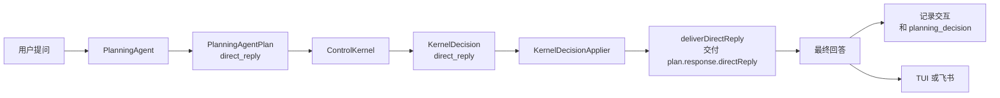
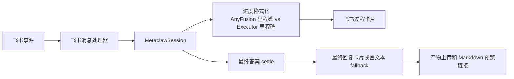

# AnyFusion

[English Technical Overview](technical-overview.md) | [中文首页](../../README.zh-CN.md)

> 当前实现基线（2026-08-03）：PlanningAgentPlan v7、Work Graph
> v6、Kernel event/snapshot/decision contract v5、Completion Protocol v3，
> 以及支持唯一事务式 29→30 迁移的 SQLite schema v30。`KernelWorkflow` 串行完成
> event、Decision 和 application，attempt supervisor 在单一活跃顶层 Task
> 内并行启动最多四个隔离 attempt。ADR-0011 保持有效；多顶层 Task 调度
> 属于未来独立路线图。

AnyFusion 是一个本地优先的 AI Task OS。它把自然语言需求变成可持久化、可检索、可调度、可验收的任务，让 AI 工作不再只是“回答这一轮”，而是可以跨中断继续执行、恢复上下文、规划子任务、claim executor work unit，并把最终产物交付到用户真正查看的地方。

它适合需要 AI Agent 长时间可靠工作的团队：任务有状态机，记忆有边界，自然语言主路径采用 PlanningAgent / ControlKernel / Durable KernelWorkflow / work-unit runtime，复杂任务有拆解和验收，文件产物有记录，飞书交付有后端，真实端到端烟测可以验证用户路径是否跑通。

## 核心能力

- 持久任务状态：created、ready、running、parked、blocked、done、archived、cancelled。
- 中断后通过 resume context 继续，不从头重做。
- timer 仅重查由 decision ledger 标记的容量阻塞；Executor `error` 恢复使用重要节点触发的结构化 probe，不做周期轮询。
- Kernel v5 根据纯 runnable frontier 一次授权确定性的 batch；Runtime 可并行运行最多四个 sibling attempt，但不运行多 Task 优先级调度。
- 当前强制单一活跃顶层任务，避免 ControlKernel 与 work-unit dispatch 加固期间出现多任务并存的歧义。
- 通过本地 SQLite FTS 索引向 PlanningAgent 提供显式的历史任务检索。
- 将复杂任务规划为显式 subtasks、验收标准和聚合规则。
- 将工作表示为 task-owned subtask graph，排序候选 agent classes，并让空闲 executor work units claim ready subtasks。
- Planner → ControlKernel → Runtime 是唯一策略主链；验收、retry、fallback、replan 和 recovery 不再由第二套 Agentic Loop 解释。
- 每个活动 MetaClaw session 绑定一个持久 AnyFusion-Pi Planner session；已确认偏好和运行时事实通过只读查询边界按需获取。
- 生成文件自动记录为任务产物。
- 飞书回复、文件同步和 Markdown 在线预览由后端统一处理。
- 本地 Gateway 支持多个终端连接同一个 AnyFusion runtime。
- 默认本地界面使用平级 AnyFusion-Pi Planner TUI，保留对话历史、resume/fork/archive、压缩、命令、补全、interrupt 和只读工具渲染。
- 在不转移 Task、Kernel 或 Executor 权限的前提下增加响应式只读 AnyFusion 任务面板；原 Ink UI 完整保留为备用模块。
- 提供 `npm run smoke:anyfusion` 烟测，默认验证同一持久 AnyFusion-Pi Planner session 的两轮对话记忆；文件产物场景可显式选择。

## 核心架构

AnyFusion 是面向任务的系统，而不是纯 session agent。普通 agent session 主要回答当前这一轮。AnyFusion 会判断用户输入应该保持为轻量对话、控制已有任务，还是变成一个可以调度、阻塞、恢复、检索、验收、交付和审计的持久任务。

```mermaid
flowchart LR
  User[用户] --> Surfaces[客户端入口<br/>TUI、CLI、Gateway、飞书]
  Surfaces --> Session[MetaclawSession<br/>统一 runtime 协调层]
  Session --> MemoryFast[显式记忆和偏好快路]
  Session --> Planning[Planner Work Unit<br/>PlanningAgent]
  Planning --> Plan[PlanningAgentPlan v7<br/>意图、目标、候选、<br/>v6 graph 或授权确认]
  Plan --> Event[KernelEvent<br/>plan_proposed]
  Event --> Workflow[Durable KernelWorkflow v5<br/>inbox、snapshot、decision、application]
  Workflow --> Kernel[ControlKernel<br/>frontier、batch、资源、<br/>permission 与恢复]
  Kernel --> Decision{KernelDecision}
  Decision -->|direct_reply| Conversation[KernelDecisionApplier<br/>交付 plan.response.directReply，不调 executor]
  Decision -->|clarification| Clarify[澄清<br/>请求缺失输入]
  Decision -->|task_control| Control[Task control runtime<br/>状态、恢复、清理、解除阻塞]
  Decision -->|plan_work_graph| Runtime[KernelDecisionApplier<br/>创建或绑定任务]
  Decision -->|reject/no_action| Stop[不执行<br/>保留状态]

  Runtime --> TaskOS[Task OS<br/>TaskRuntimeService]
  TaskOS --> ExecCoord[KernelExecutionRuntime<br/>构造 scheduling snapshot]
  ExecCoord --> GraphRuntime[WorkGraphRuntimeService<br/>应用已授权 work graph]
  GraphRuntime --> Graph[Work Graph<br/>持久化 Subtasks]
  Graph --> Frontier[纯 runnable frontier<br/>依赖与 publication 事实]
  Frontier --> Batch[dispatch_batch<br/>持久 child items]
  Batch --> Attempt[AttemptSupervisor<br/>最多四个 attempt]
  Attempt --> Context[SubtaskExecutionContext<br/>直接 handoff 与选定 evidence]
  Context --> Executors[ExecutionRuntime<br/>canonical Codex / Pi sandbox]
  Executors --> Verify[Completion Protocol v3<br/>delta、receipt 与 candidate commit]
  Verify --> Publish[Git publication gate<br/>稳定顺序集成]
  Publish --> Delivery[交付和 UI<br/>TUI 进度、飞书、文件、预览链接]
  Conversation --> Delivery
  Clarify --> Delivery
  Control --> Delivery
  Stop --> Delivery
  Delivery --> User

  Session <--> Store[(本地 SQLite<br/>任务、subtasks、agent classes、<br/>work units、events、memory)]
  Workflow -. audit .-> Decisions[(kernel_decisions)]
  TaskOS <--> Store
  Graph <--> Store
  Attempt <--> Store
```



所有自然语言输入统一进入隔离的 AnyFusion-Pi `PlanningAgent`，产出严格 v7 `PlanningAgentPlan`。Work Graph 使用 v6 契约，Planner 不枚举资源 claim 或 execution layer。`ControlKernel` 根据 frontier、pending/active item、AgentClass、资源和 slot 事实授权确定性 batch；Execution 并行运行 attempt，并由 publication worker 按拓扑层、首次授权顺序和 Subtask ID 发布成果。

AnyFusion-Pi `PlanningAgent` 使用专用 process runner，而不复用 Executor adapter。一个活动 MetaClaw session 对应一个持久 Pi session 文件。非交互入口以 `--mode rpc` 启动 Planner，通过 stdin/stdout 交换 JSONL；同一 session 的 turn 串行执行，避免多个进程并发写入 session 文件。Planner fork 管理对话历史和固定 system instructions；MetaClaw 不再从 SQLite interaction 重建提示词。Provider/Model 与 Planner 工具由 AnyFusion 固定管理。每个语义 turn 通过受限原生 `submit_planning_proposal({ plan })` 工具提交；runtime 注入 session、turn、user input 和 deterministic submission identity。rejection 是当前 ReAct turn 的结构化反馈，transport uncertain 与 rejection 严格分离；不存在 assistant 文本 proposal parser、proposal 专用 retry、repair prompt 或外层 validation loop。

本地 AnyFusion-Pi TUI 与 RPC runner 通过 mode-`0600` Unix JSONL `PlannerTuiBridge` 和 Host Protocol v2 共用同一 proposal 工具链。bridge 还提供有界只读 Task 投影、`command_complete/command_completion`，并透传用户明确输入的 MetaClaw slash command。Pi 复用原生异步编辑器、候选列表、Tab、上下键和 tool-call 机制；命令树遍历、replacement range、hint/error、动态 Task/Executor 候选、参数校验与执行仍唯一来自 `MetaclawSession → CommandCatalog/InputController`。MetaClaw 持久化 proposal submission，实现 rejected revision、accepted turn lock、identical replay 和 conflict；Pi 只展示补全数据或权威结果，不获得通用 mutation API，也不能直接调用 Kernel、调度、Execution 或 Executor。

Executor 健康恢复是事件驱动的。`ExecutorRecoveryRefreshService` 只检查
enabled 且持久健康状态已经是 `error` 的 AgentClass，对同一 class 的并发
刷新进行合并，单次 probe 最长 30 秒，并把有界、脱敏的恢复证据和真实
attempt 历史分开保存。成功 probe 只允许 `error -> healthy`；`disabled`
是管理锁，healthy/unverified 不会被反向巡检。触发点是 Session 启动、
planning cycle、Task resume/recovery、Executor 配置变化和
`/executor refresh [name|all]`。

Planning 与恢复刷新并行开始，但 Kernel 准入前必须等待两者汇合。相关候选
恢复时，Planner 可在同一个持久 AnyFusion-Pi Planner session 中修订一次提案。已有 Task
仍无可用 eligible class 时，Kernel 会把精确提案保存为
`waiting_for_availability` 并结构化阻塞；后续 `executor_recovered` 事实
可重新准入该提案，将 Task 转为 `ready`，不会再次调用 Planner，也不会立即
dispatch。

### 普通问答路径



这条路径仍然是语义驱动。持久 AnyFusion-Pi Planner session 保留“继续”或“你刚才回答了一半”等对话上下文；持久 MetaClaw 事实仍通过 MCP 显式查询。PlanningAgent 把最终答案写入 `response.directReply`，runtime 原样交付。

### 持久任务路径

```mermaid
flowchart LR
  Input[用户要求执行工作] --> Planning[PlanningAgent]
  Planning --> Proposal[PlanningAgentPlan<br/>WorkGraphProposal]
  Proposal --> Kernel[ControlKernel<br/>授权或重写]
  Kernel --> Decision[KernelDecision<br/>plan_work_graph]
  Decision --> Apply[KernelDecisionApplier]
  Apply --> Task[TaskRuntimeService<br/>创建或绑定任务]
  Task --> Scheduler[SchedulerEngine<br/>准备度、优先级、空闲恢复]
  Scheduler --> WorkGraphRuntime[WorkGraphRuntimeService<br/>应用已授权 graph]
  WorkGraphRuntime --> WorkGraph[Work Graph<br/>持久化 Subtasks]
  WorkGraph --> Ready[Runnable frontier<br/>直接依赖已发布]
  Ready --> Batch[Kernel dispatch_batch<br/>持久 attempt items]
  Batch --> Attempt[Attempt supervisor<br/>独立 claim 与运行]
  Attempt --> Run[ExecutionRuntime<br/>传输并执行]
  Run --> Verify[Completion Protocol v3<br/>delta、receipt 与 candidate]
  Verify --> Publish[Git publication gate]
  Publish --> Done{是否集成？}
  Done -->|是| Result[原子发布 result、handoff、<br/>artifact、workspace state 与 done]
  Done -->|冲突| Repair[Kernel 授权原 AgentClass repair]
```



这就是 Task OS 路径。任务状态、恢复上下文、Kernel 授权、Subtask 状态、WorkUnit/resource lease、产物捕获、验收和 Git publication 都在这里发生。ADR-0011 仍保持一个已接纳的顶层任务，但该 Task 内互不依赖的 Subtasks 已可并行。

当前自然语言路径有一个明确约束：同一时间只接纳一个活跃顶层任务。普通问答、澄清、状态查询、清理任务命令，以及明确指向当前活跃任务本身的请求仍然允许通过。新的无关顶层任务由 `ControlKernel` 拒绝并给出可见提示，直到当前任务完成，或取消后的容器与 lease 清理完毕。多 Task candidate、优先级、公平性和饥饿保护不属于已完成的 Phase 6，统一移入未来独立路线图。

### 飞书和进度展示路径



飞书进度会刻意区分 AnyFusion 里程碑和具体 executor 里程碑。用户能看到当前是 AnyFusion 在规划、召回上下文、调度、claim work unit，还是具体 executor 正在执行。

conversation / task 的边界很重要：

- Conversation：即时回答，不创建持久任务。持久 AnyFusion-Pi Planner session 负责对话连续性；direct reply 持久化为审计事实，但不会被回放进后续提示词。
- Task control：查看或改变已有任务状态。适合“当前在跑什么”“继续那个任务”“清空阻塞任务”。
- Durable task：创建或继续需要执行、持久化、产物、恢复、调度或后续检索的工作。

当前 direct reply 路径是显式的：MetaClaw 把当前轮发送给已绑定的持久 AnyFusion-Pi Planner session，PlanningAgent 仅在需要时通过 MCP 查询确认偏好或运行时事实，runtime 直接交付 `response.directReply`，不 claim executor work unit。

[AnyFusion Task OS 架构与策略升级方案](../archive/plans/2026-06-14-metaclaw-task-os-architecture-strategy-upgrade.md) 中的本轮主线已经进入代码：确定性任务检索索引、PlanningAgent work graph proposal、统一 `ControlKernel` authorization、持久化 subtasks、work-unit claiming、汇总与验收都已实现并有针对性测试覆盖。Executor Discovery、远程 Registry、弹性 work-unit spawn 和大规模多客户端 Gateway 扩展仍然不是本轮重点。

重要边界：Agentic Loop 已作为核心架构层实现并测试；当前交互式/script session 默认执行路径仍沿用 session runtime，只有明确接入策略/编排循环的功能路径才会调用它。这样可以在增强复杂任务验收能力的同时，保持现有用户路径稳定。

## 当前执行器

| 执行器 | 命令 | 适合任务 | 安装要求 |
| --- | --- | --- | --- |
| Codex CLI | `codex` | 仓库修改、测试、确定性实现、带 patch 的代码审查 | 统一 Runtime 已内置并配置；只有直接 Linux 开发才需本机安装 |
| Pi Agent | `pi` | 调研、报告生成、多步骤信息综合、agentic CLI 工作流 | 统一 Runtime 已内置并配置；只有直接 Linux 开发才需本机安装 |

默认 worktree 后端只执行 canonical `codex-cli` 与 `pi-agent`。获批后，Runtime claim 或创建 WorkUnit，再把对应 CLI 作为统一 Runtime 的子进程启动，并把 `cwd` 设为当前 Subtask Git worktree。该路径不扩展第三方 Executor 注册；旧 Docker attempt 后端仍可通过 `METACLAW_EXECUTOR_BACKEND=docker` 显式启用。

## 前提条件

必须具备：

- Node.js `>=22.19.0`。
- npm。
- Git。
- Unix-like shell 环境，优先支持 macOS 和 Linux；Windows 用户推荐使用 WSL2，这是当前支持的可靠安装路径。
- `better-sqlite3` 的原生编译工具链。

推荐安装编译工具：

```bash
# macOS
xcode-select --install

# Ubuntu / Debian
sudo apt-get update
sudo apt-get install -y build-essential python3 make g++
```

执行器前提：

- 统一 Runtime 镜像已内置 Codex/Pi CLI 和配置。
- 直接 Linux 开发时，在本机安装并配置要使用的 canonical CLI。
- 只有 Docker 兼容模式才需要构建或拉取 canonical attempt 镜像。

飞书集成前提：

- 飞书应用具备消息接收和发送权限。
- 将 app secret 放入环境变量，例如 `FEISHU_APP_SECRET`。
- 使用双向飞书对话时，订阅 `im.message.receive_v1`。
- 如需回传文件，开启文件上传和发送消息能力。
- 推荐使用 WebSocket 事件投递，因为它不需要公网回调 URL。
- 公网反代或内网穿透仅在 webhook 模式或外部 Markdown 预览链接时需要。

Markdown 在线预览前提：

- `integrations.markdown_preview.enabled: true`。
- 如果用户不在宿主机上打开链接，需要配置可访问的 `public_base_url`。

## 安装

大多数用户按这个顺序安装和验证：

```bash
git clone https://github.com/MetaAny/AnyFusion.git
cd AnyFusion
./setup.sh
anyfusion --help
npm run smoke:anyfusion
```

看到 `anyfusion --help` 能打印 CLI 帮助，并且 `npm run smoke:anyfusion` 最后输出下面内容，才说明安装后真实用户路径可用：

```text
MetaClaw native Planner session smoke passed.
Scenario: planner-session
Native session: /var/lib/metaclaw/codex/planner/sessions/...jsonl
```

`setup.sh` 会安装 AnyFusion 本身、构建 CLI、执行 `npm link`、生成 `~/.metaclaw/config.yaml`，并自动检测当前系统里的 Executor。

在交互式终端里，它会展示检测到的 Executor 列表，让用户选择要接入哪几个 Executor，并选择哪个作为默认 Executor。如果选择了缺失但支持自动安装的 Executor，setup 可以直接安装。没有任何 Executor 可用时，默认 fallback 是安装 Codex CLI：

```bash
npm install -g @openai/codex
```

如果 setup 过程中刚安装了 Codex CLI，先打开一次 Codex 并完成登录，再运行真实任务：

```bash
codex
```

安装核验清单：

- `node --version` 是 `>=20`。
- `./setup.sh` 最后显示“安装完成”。
- `~/.metaclaw/config.yaml` 已生成。
- 新开一个 shell 后，`anyfusion --help` 可用。
- 默认 executor 命令可用，例如 `codex --help`。
- `npm run smoke:anyfusion` 通过，并打印原生 Planner session 路径。

setup 可选参数：

```bash
# 默认不覆盖已有 ~/.metaclaw/config.yaml
METACLAW_OVERWRITE_CONFIG=false ./setup.sh

# 强制重写 ~/.metaclaw/config.yaml
METACLAW_OVERWRITE_CONFIG=true ./setup.sh

# 只构建，不执行 npm link
METACLAW_INSTALL_MODE=none ./setup.sh

# 没有 Executor 时也不自动安装 Codex CLI
METACLAW_INSTALL_CODEX=false ./setup.sh

# 强制使用非交互默认行为
METACLAW_SETUP_INTERACTIVE=false ./setup.sh
```

手动安装 fallback：

```bash
npm install
npm run build
npm link
```

检查 CLI：

```bash
anyfusion --help
```

如果 setup 后提示找不到 `anyfusion` 命令，先新开一个 shell，让 `PATH` 重新加载 npm global link。如果仍然找不到，重新执行手动安装 fallback，并用 `npm config get prefix` 检查 npm global bin 目录是否在 `PATH` 中。

## Windows 安装

Windows 用户推荐使用 WSL2 + Ubuntu。这样可以提供 AnyFusion 当前需要的 Unix-like shell、原生编译工具链、socket、进程行为和 executor 兼容性。

先在 Windows PowerShell 中安装 WSL2：

```powershell
wsl --install -d Ubuntu
```

如果系统提示重启，重启后打开 Ubuntu，在 WSL 内安装依赖：

```bash
sudo apt-get update
sudo apt-get install -y git curl build-essential python3 make g++

curl -fsSL https://deb.nodesource.com/setup_20.x | sudo -E bash -
sudo apt-get install -y nodejs

node --version
npm --version
git --version
```

然后在 WSL Ubuntu shell 内安装并验证 AnyFusion：

```bash
git clone https://github.com/MetaAny/AnyFusion.git
cd AnyFusion
./setup.sh
anyfusion --help
npm run smoke:anyfusion
```

如果 setup 过程中安装了 Codex CLI，先在 WSL 里打开一次 Codex 并完成登录，再执行真实任务：

```bash
codex
```

Windows 安装核验清单：

- 在 WSL Ubuntu 里运行 AnyFusion 命令，不要在 Windows PowerShell 里直接运行。
- 仓库建议放在 WSL 文件系统，例如 `~/AnyFusion`，不要放在 `/mnt/c/...`，这样文件和 SQLite 性能更稳定。
- `node --version` 是 `>=20`。
- 新开一个 WSL shell 后，`anyfusion --help` 可用。
- 默认 executor 在 WSL 内可用，例如 `codex --help`。
- `npm run smoke:anyfusion` 成功完成

Windows 原生 PowerShell 不是当前推荐的主要运行环境。高级用户可以使用 Node.js 22.19+、Git、Visual Studio Build Tools、`npm install`、`npm run build` 和 `node dist/index.js` 直接开发，但 `setup.sh`、`anyfusion.sh`、Unix socket Gateway 行为以及下游 executor CLI 可能和 Linux/macOS 不一致。Windows 的受支持路径是统一 Docker runtime；直接 Linux 开发可使用 WSL2。

## 安装执行器

AnyFusion 不内置下游执行器 CLI。你需要自己安装要使用的执行器，并确保命令在 `PATH` 中。

### 注册自定义 Executor

Executor 是 AnyFusion 可以分配 subtask 的运行时工人。一个已注册 Executor 现在包含三层信息：

- `AgentClass`：适用领域、能力、风险等级、输入/输出类型、适用场景、route-intent affinity 和 runtime 默认配置。
- 运行绑定：不可变 Docker image ID、受控 permission profile、容器内命令/参数、安装检测命令和可选项目地址。
- 至少一个 executor `WorkUnit`：一个具体的空闲 runtime slot，一次 claim 一个 ready subtask。

如果不确定具体该填什么，使用问答式注册向导：

```bash
/executor register wizard
```

向导会依次询问 Executor 名称、是否从项目地址推断、运行命令、非交互参数、安装检测命令、适用领域和能力。如果提供 GitHub 项目地址，AnyFusion 会尝试从 `package.json` 或 README 示例推断 CLI 信息；如果无法可靠推断，会自动回到手动填写。

也可以一次性注册：

```bash
/executor register research-bot \
  --image registry.example/research-bot:1.2.3 \
  --image-id sha256:<64-hex-digest> \
  --permission-profile restricted-custom \
  --command research-bot \
  --args "run --prompt {prompt}" \
  --check "research-bot --version" \
  --project-url https://github.com/example/research-bot \
  --domains research,reporting \
  --capabilities research,report_generation
```

`{prompt}` 会被替换为 subtask 提示词。如果 `--args` 不包含 `{prompt}`，AnyFusion 会把 prompt 追加为最后一个参数。image ID 必须匹配引用镜像，permission profile 必须来自受控目录。缺少绑定、镜像标签漂移或 profile 无效都会 fail closed；不存在宿主进程 fallback。路由 capability 仍与权限事实分离，不把权限细节暴露给 Planner。

`codex-cli` 与 `pi-agent` 完全由 canonical built-in definitions 管理。启动时会把这两个名称对应的全部静态字段、不可变镜像绑定和 permission profile 强制收敛，常规注册接口也拒绝覆盖或删除。非 canonical capability 仍是自由注册元数据，不会自动进入受控 Planner catalog；缺少 image/profile 的历史自定义类保留审计记录但不可执行。

Phase 5 的权限产品边界是 sandbox profile 加持久 request/grant/use 审计预算。`use_capability` 会原子消费 attempt identity、expiry、调用次数和字节预算，但它不是通用 operation broker，也不证明每个原生文件、网络或外部动作都经过细粒度中介。当前实际强制边界仍是容器 mount、egress profile 和 resource lease。

Executor 扩展契约：

必需的路由字段：

- `name`：稳定的 Executor 名称，例如 `research-bot` 或 `finance-research-agent`。
- `domains`：适用领域，例如 `research`、`finance`、`software`。
- `capabilities`：能力标签，例如 `research`、`report_generation`、`multi_tool`、`coding`、`tests`。

建议的路由字段：

- `inputTypes`：支持输入类型，例如 `text`、`files`、`image`。
- `outputTypes`：输出类型，例如 `markdown`、`report`、`code`、`patch`、`json`。
- `primaryUseCases`：适合路由给它的典型任务。
- `avoidUseCases`：不适合路由给它的任务。
- `riskLevel`：`low`、`medium` 或 `high`。
- `intentAffinity`：按 route intent 记录的 affinity，例如 `repo_execution`、`research_workflow`、`memory_agent_ops` 和 `general`。
- `projectUrl`：项目仓库或文档地址。

Executor 健康状态与近期结果属于动态状态。Planner 通过 `list_executor_status` 读取，不再将其保存为 AgentClass 的静态路由元数据。Runtime 在故障发生点持久化有界、脱敏的诊断事实，但不把它们被动注入每轮 Planner 上下文；用户追问执行为何失败或阻塞时，Planner 才通过显式只读诊断工具查询并用自然语言解释。

必需的运行绑定：

- `runtimeCommand`：本机 `PATH` 上可执行的命令，例如 `research-bot`。
- `runtimeArgs`：非交互运行参数，例如 `["run", "--prompt", "{prompt}"]`。
- `runtimeCheckCommand`：安装或可用性检测命令，例如 `research-bot --version`。

运行行为要求：

- 必须能非交互运行，不能等待人工输入。
- 必须能通过 `{prompt}` 或最后一个参数接收完整任务提示词。
- 最终答案应输出到 stdout。
- 失败时应返回非 0 exit code，或在 stderr 输出明确错误。
- 长任务应周期性输出进度，避免被 idle watchdog 判断为卡死。
- 文件产物应写入 prompt 中指定的任务输出目录。
- 飞书交付、文件上传和预览链接生成应由 AnyFusion 后端完成；Executor 应产出本地文件，不应自己直接调用飞书 API。

可选高级 Adapter 接口：

- `execute(input)`：用结构化上下文执行任务。
- `isAvailable()`：检测 Executor 是否可运行。
- `abort(attemptId?)`：精确中止一个 attempt；整 Task 取消由 Runtime control port 枚举其全部 active attempts。
- `installSkill(pkg)`、`updateSkill(pkg)`、`disableSkill(target)`、`deprecateSkill(target)`：支持 Executor 自己的 Skill 生命周期管理。

常用管理命令：

```bash
/executor list
/executor show <name>
/executor register wizard
/executor unregister <name>
/executor feedback <taskId>
```

### Codex CLI

安装并登录 Codex CLI 后验证：

```bash
which codex
codex --help
```

默认配置：

```yaml
executor:
  command: codex
  timeout: 300
  max_duration: 3600
```

`timeout` 表示连续无输出 watchdog，不是固定墙钟总时长限制。只要 executor 仍在 stdout 或 stderr 输出内容，AnyFusion 就会续期，不会因为运行时间长而杀掉仍活跃的进程。`max_duration` 仅保留用于兼容旧配置，不再用于终止活跃 executor。

### Pi Agent

安装 Pi coding agent CLI 并完成登录：

```bash
npm install -g @earendil-works/pi-coding-agent
which pi
pi --help
```

AnyFusion 调用方式：

```bash
pi -p "<prompt>"
```

Pi attempt 默认通过统一的 `SandboxedExecutorAdapter` seam 在当前 Subtask worktree 中运行 `pi` 子进程；Docker 兼容模式仍使用 canonical `metaclaw-executor-pi:phase5` 镜像。

## Executor 与 Skill 的差异

Executor 和 Skill 是生态里的不同层。

Executor 是“谁来干活”。Skill 是“干活时带什么方法、知识和工具规范”。

Executor 是 AgentClass runtime，例如 canonical Codex CLI 与 Pi Agent。它可以作为 worktree 子进程运行，也可以走 Docker 兼容后端；它决定模型、工具链、权限、运行环境、上下文窗口、文件读写能力、非交互执行方式、成本和可靠性边界。

Skill 更像轻量能力包。它描述某一类工作应该怎么做：怎么做期货分析、怎么做代码审查、怎么跑调研流程、怎么输出报告格式。Skill 可以改善某个 Executor 的表现，但不会自动改变这个 Executor 的 runtime、权限、工具或安装状态。

Executor 的优势：

- 增加新的 runtime 边界，包括模型、工具、凭证、权限和命令行行为。
- 让 AnyFusion 可以把 ready subtask 分配给最适合该工作的 executor work unit。
- 支持 planner-driven reassignment、交叉验证和审计。
- 可以接入通用 Skill 无法访问的私有系统或垂直领域系统。

Executor 的代价：

- 安装和配置更重。
- 必须明确非交互运行命令和可用性检测方式。
- 需要处理权限、超时、失败、heartbeat 和恢复。
- 多个 runtime 行为不一致时，会增加运维复杂度。

Skill 的优势：

- 更轻量，添加速度快。
- 适合沉淀可重复的方法、清单、领域启发和输出规范。
- 能提高同一个 Executor 在特定任务上的一致性。
- 运维成本比新增 runtime 更低。

Skill 的限制：

- 受限于 Executor 镜像、permission profile、受控上下文和 model gateway。
- 不能凭空获得不存在的 CLI、私有 API、浏览器能力、文件权限或企业系统集成。
- 通常提升执行质量，而不是扩展 runtime 边界。

当缺失能力来自“需要不同工人或不同 runtime”时，AnyFusion 通过注册 Executor 扩展能力；当已有工人需要更好的流程、领域知识或输出规范时，通过 Skill 扩展能力。

## 运行

```bash
anyfusion
```

默认命令启动固定版本的 AnyFusion-Pi Planner TUI：

- AnyFusion-Pi 持有 conversation transcript、resume/fork/archive、compaction、斜杠命令、补全、中断处理和只读工具渲染。
- 可执行命令为 `anyfusion-planner`；fork 禁用用户可见的 Pi/Earendil 品牌、账号登录、自更新和任意 Provider/Model 切换。
- 本地 host bridge 传递有界的全局 Task 池以及当前 Task/Subtask/Executor/blocking 投影。宽/中终端在 transcript 右侧显示 dashboard；窄终端自动隐藏并保持普通对话可用。显式 Pi 原生 Loader 动态展示当前快照中的 Executor 名称，并在名称清空或快照 unavailable/stale 时停止。初始 loading、unavailable 和 malformed/stale snapshot 只降级面板，不修改 Task 状态。
- Host Protocol v2 通过 `executor_result` capability 被动补发当前 MetaClaw session 尚未展示的 integrated Subtask publication。Pi 为每条结果持久化一条可见 custom message，包含 Executor 总结、warnings、integration commit 和全部 artifact 路径。写入使用 `triggerTurn: false`：消息进入后续 Planner 上下文，但不启动或 steer 回合；Planner 仅在当前用户明确询问结果、输出、artifact 或状态时查看。
- 当前投影和 dashboard 都是只读的，不能写 Task 状态、选择策略、调度 attempt、调用 Kernel 或控制 Executor。
- direct reply 与 clarification 由 accepted tool result 展示；rejected proposal 可在同一 Agent turn 修订，首个 accepted submission 终止本轮并展示 MetaClaw 权威 `displayText`。
- bridge 断开、数据过期或格式错误会明确降级 Task 投影或 proposal 提交，不能伪装 Task 已创建，也不得终止普通对话。
- 设置 `METACLAW_STANDBY_TUI=1` 可启动完整保留的 Ink 备用实现；该模块不是默认入口，也不承担本次迁移后的持续功能开发。

或使用项目脚本：

```bash
./anyfusion.sh start
```

首次启动会创建：

```text
~/.metaclaw/
├── config.yaml
├── metaclaw.db
└── gateway.sock
```

连接已有实例：

```bash
./anyfusion.sh connect
```

运行管理：

```bash
./anyfusion.sh status
./anyfusion.sh logs
./anyfusion.sh logs -f
./anyfusion.sh restart
./anyfusion.sh stop
```

安装或管理用户级 Gateway 服务：

```bash
./anyfusion.sh gateway install
./anyfusion.sh gateway start
./anyfusion.sh gateway status
./anyfusion.sh gateway restart
./anyfusion.sh gateway stop
```

直接 Gateway 模式：

```bash
anyfusion --gateway
anyfusion --connect
```

### 在 Docker 中运行（macOS / Windows / 容器化）

在 macOS 和 Windows 上，`docker/` 工作流将 Linux Runtime 作为 SSH 服务运行，为原生 TUI 提供真实 PTY，并允许通过 shell 或 VS Code Remote-SSH 浏览 `/workspace`。这条受支持路径需要 Docker Desktop，因为 Runtime 与 Executor CLI 依赖 Linux。一次 BuildKit 构建以 MetaClaw 为默认 context，并以兄弟 AnyFusion-Pi 仓库为必需的 `anyfusion-pi` context。最终镜像只包含一份 Node 22.19+，MetaClaw control process 位于 `/app`，隔离的 Planner process 位于 `/opt/anyfusion-planner/app`，两者保留独立依赖树；canonical Codex/Pi attempt 直接在该 Runtime 内作为 worktree 子进程运行。

完整 Runtime image 内置 MetaClaw CLI、v7 schema、编译后的 Planner MCP server、构建后的 AnyFusion-Pi 应用、版本化 host bridge、Codex/Pi CLI 与对应配置。`docker/Dockerfile.runtime` 构建两个仓库 context，并把两个独立应用树复制进最终镜像。Planner launcher 与 MetaClaw 注入的 `/app/dist/planner-mcp.js` 命令都使用 `/usr/local/bin/node`，禁止存在 `/opt/anyfusion-planner/node`。默认 launcher 只启动这一个 Runtime 容器，不挂 Docker socket、不构建 sibling Executor 镜像，也不创建 attempt control network。任一仓库源码变化后都使用 `docker/shell.ps1 -Rebuild`；只保留 workspace/data volume。完整要求见 [Phase 5 Runtime Security](phase-5-runtime-security.md)。

## 配置

编辑：

```bash
~/.metaclaw/config.yaml
```

示例：

```yaml
version: 1

executor:
  command: codex
  timeout: 300
  max_duration: 3600

orchestration:
  reminder_enabled: true
  reminder_throttle: 300
  top_k_preferences: 5
  blocked_recheck_enabled: true
  blocked_recheck_interval: 60

ui:
  language: zh-CN
  dashboard_on_start: true

notifications:
  feishu:
    enabled: false
    webhook_url: ""
    secret: ""

gateway:
  enabled: true
  platforms:
    feishu:
      enabled: true
      domain: feishu
      connection_mode: websocket
      app_id: ""
      app_secret_env: FEISHU_APP_SECRET
      event_port: 8787
      event_path: /feishu/events
      verification_token: ""
      encrypt_key_env: FEISHU_ENCRYPT_KEY
      home_channel: ""
      access:
        dm_policy: pairing
        allowed_users: []
        group_policy: open
        require_mention: true
      delivery:
        final_markdown_mode: card
        fallback_mode: post
        final_file_fallback: true

integrations:
  markdown_preview:
    enabled: true
    host: 127.0.0.1
    port: 8790
    public_base_url: ""
```

启动前导出飞书密钥：

```bash
export FEISHU_APP_SECRET="your Feishu app secret"
./anyfusion.sh start
```

## 飞书交付和在线预览

AnyFusion 将“文档生成”和“飞书交付”分开处理：

- 执行器只负责把 Markdown 或其他文件写入任务输出目录。
- AnyFusion 将文件记录为 task artifacts。
- 飞书后端把最终答案发回聊天。
- 如果文件上传能力可用，飞书后端会上传任务产物。
- 如果配置了 Markdown Preview，Markdown 产物会附带在线预览链接。
- 投递尝试会写入 `~/.metaclaw/gateway-audit.jsonl`。

执行器不应该直接调用飞书云文档 API。用户说“飞书云文档”或“在线预览”时，AnyFusion 会要求执行器产出本地 Markdown 产物，后端负责飞书同步和预览链接。

飞书进度卡片会明确展示执行链路。AnyFusion 先进行意图解析和执行准备，然后展示 planner work-graph 决策、work-unit claim 状态，以及真正启动 subtask 的执行器。这样飞书用户不会把意图解析器、planner 或 dispatcher 误认为最终执行器。

最终飞书回复优先使用 Markdown message card。长回复会拆成多张卡片；如果某个卡片 chunk 失败，AnyFusion 会把该 chunk 重试为富文本 post；如果仍有 chunk 无法投递，会上传完整最终答案 Markdown 文件，避免用户只收到半截结果。

访问控制由 Gateway 处理：

- 私聊默认使用 `dm_policy: pairing`。第一个私聊用户会自动通过，后续用户可用 `anyfusion gateway pairing` 审批或撤销。
- 群聊默认使用 `group_policy: open` 和 `require_mention: true`。
- 在飞书聊天里发送 `/sethome` 会把该聊天记录为 `gateway.platforms.feishu.home_channel`。
- Feishu 配置只从 `gateway.platforms.feishu` 读取。

常用飞书 Gateway 命令：

```bash
anyfusion gateway doctor
anyfusion gateway pairing list
anyfusion gateway pairing approve <open_id>
anyfusion gateway pairing revoke <open_id>
```

默认预览 URL：

```text
http://127.0.0.1:8790/preview/<artifact>
```

如果飞书用户不在宿主机上打开链接，需要暴露 preview 服务并设置：

```yaml
integrations:
  markdown_preview:
    enabled: true
    host: 127.0.0.1
    port: 8790
    public_base_url: https://preview.example.com
```

## 任务工作流

用自然语言创建任务：

```text
> 对比三份合同的风险点，并生成风险矩阵。
```

AnyFusion 会：

1. 判断输入是轻量对话、任务控制，还是持久任务。
2. 创建新任务或定位已有任务。
3. 检索可用的历史任务上下文。
4. 计算语义优先级。
5. 让 planner 选择 planner outcome，或构建 subtask work graph。
6. 持久化带依赖、候选 agent classes 和验收标准的 ready subtasks。
7. 为每个 ready subtask claim 一个空闲 executor work unit，并持续记录进展。
8. 保存结果摘要、文件产物和任务记忆。
9. 给出下一步建议。

常用命令：

```bash
/task list
/task list active
/task list ready
/task list parked
/task list blocked
/task list done

/task show <id>
/task pause <id>
/task resume <id>
/task block <id> waiting for customer data
/task unblock <id>
/task unblock <id> /tmp/evidence-v4.pdf
/task cancel <id>
/task <taskId> subtask cancel <subtaskId...>
/task <taskId> accept-partial
/task index rebuild
/task index search <query>

/task dashboard
/task attach <taskId> <file paths...>
/task history <taskId>
/config
/help
/exit
```

主 TUI 的补全、`/help`、参数校验和执行都来自同一个 `CommandCatalog`。`↑/↓` 选择候选，`Tab` 只补全光标所在 token，`Enter` 只提交完整且有效的命令；目录节点、缺参命令和无效动态引用会保留在编辑器中。旧扁平入口和 aliases 不再注册。

AnyFusion-Pi 下游原生 TUI 是默认本地入口。Planner fork 持有会话交互；MetaClaw 向
面板投影只读 Task 状态，并继续独占确定性命令执行以及所有持久化 Task、Kernel 和 Executor 权限。Pi TUI 通过 host bridge 查询完整 MetaClaw 命令树，使用 Pi 原生补全 UI 展示候选并应用 MetaClaw 返回的 replacement range，提交前再次校验，再透传用户原始输入；它不维护第二套 CommandCatalog。AnyFusion 像素风欢迎组件在 quiet startup 下仍保留，展示 Planner 版本、bridge 状态、模型/工作区与有界任务摘要。
原 Ink TUI 完整保留在 `src/tui/`，可通过 `METACLAW_STANDBY_TUI=1` 启动，但它是
备用模块而不是第二套持续维护的前端。飞书与 Gateway 是后端交付面，不依赖本地使用哪套 TUI。

## 任务检索

AnyFusion 会用本地 SQLite FTS5 建立任务检索索引，让历史工作可以被重新发现。用户不需要记住准确 task id；Planner 可先用查询文本搜索，再读取明确选中的任务上下文。

命令：

```bash
/task index rebuild
/task index search 合同 风险 矩阵
```

该索引是确定性读模型，不是语义路由器。PlanningAgent 决定历史任务是否相关，调用 `search_tasks` 搜索，再通过 `get_task_context` 读取选中的记录。Runtime 不根据用户措辞推断任务连续性、相关历史、时间线意图或恢复/参考模式。

## 单 Task 并发调度模型

AnyFusion 当前只调度一个活跃顶层 Task。Work Graph 纯函数从依赖、Subtask 生命周期和 pending/active item 推导稳定 runnable frontier；Kernel v5 在全局上限四个 slot 内一次授权 batch。`KernelWorkflow` 仍串行决定和落应用，attempt supervisor 才异步 claim/run child item，因此 sibling 的启动 race、容量不足或失败不会取消其余 item。

当一个顶层任务正在运行时，`ControlKernel` 会拒绝新的无关自然语言 durable task，以及针对其他任务的执行请求。它仍允许普通问答、澄清、状态查询、清理任务命令，以及明确指向当前活跃任务的请求。Slash command 和确定性执行入口也进入统一 Kernel seam。第二个顶层任务的排队、紧急抢占和自动恢复在当前范围内刻意关闭；ADR-0011 把这记录为一个可逆决策。

单个已接纳的顶层任务内部可以存在多个并行 Subtasks。一个 Subtask 同时最多一个 pending/active attempt；attempt、WorkUnit 和短命 Executor 进程一一绑定。完成顺序不决定发布顺序，`awaiting_integration` 期间下游不可运行。

整 Task 取消和显式 Subtask 取消也必须进入 durable Kernel seam。取消栅栏先提交，`cancelling` dispatch/publication 在精确 sandbox 退出或确认缺失、WorkUnit 与 lease 释放前继续占用容量；晚到 outcome 只记为 `no_op`。Subtask 取消按下游闭包原子执行，不影响独立 sibling；剩余工作收束后 Task 进入 `blocked`，用户只能取消整个 Task，或通过 `/task <taskId> accept-partial` 显式接受已发布部分。

## PlanningAgent、ControlKernel 和 Work Unit

自然语言 dispatch 拆成 Planner 理解、Kernel 授权和 Runtime 执行三层。除 slash command、显式 ID、路径、URL 和附件外，raw input 都进入 `PlanningAgent`；自然语言“记住”不再是快路。Planner 可按需调用只读 MCP，并通过原生 proposal 工具提交严格 v7 `PlanningAgentPlan`。Work Graph 使用 v6 契约；授权确认只能解释同一 Task 中既有精确 request ID，不能修改 target、scope 或 grant。

- `direct_reply`、`clarification`、`task_control` 或 `no_action`：除非 kernel 把 plan 重写为可执行工作，否则不应 claim executor work unit。
- `plan_work_graph`：planner 提出一个 work graph proposal，节点是未来的 `Subtask` 记录。每个 proposal 都带有依赖、验收标准、`deliveryKind: edit | report`、受控的 `requiredCapabilities` 和完整有序的 canonical AgentClass 候选集合。

`ControlKernel` v5 验证 schema、priority、task status、单活跃任务冲突、Work Graph、AgentClass 和 scheduling snapshot，也唯一决定 batch dispatch、Task/Subtask 取消、显式部分接受、generation replan、deferred availability、Executor recovery、retry/fallback、merge repair/conflict replan、permission grant/deny/escalate、partition wait 和 sandbox recovery。

`DurableKernelWorkflow` 负责 event inbox、Decision/application 原子 issuance、幂等 Runtime apply 和 observation drain。`WorkGraphRuntimeService` 只持久化或投影 Kernel 授权的 v6 Work Graph revision。`KernelExecutionRuntime` 构造快照并应用授权；`AttemptSupervisor` 管理 durable child launch；`SubtaskAttemptRunner` 负责 attempt-aware claim、唯一 context、Completion Protocol、receipt 和 candidate commit；`WorkspacePublicationWorker` 负责稳定 Git 集成与原子 completion 发布。

旧版 `ExecutorRouter`、`ExecutorRoutingCoordinator`、`ExecutionPolicyPlanner` 以及 `IntentOrchestrator` 路由子系统已整体删除——不再有独立的 executor-selection 层。`repo_execution`、`research_workflow` 等旧 route intent 名称仅作为 agent class 排序的 affinity key 保留。

## 复杂任务策略和 Agentic Loop

AnyFusion 可以把复杂需求表示成 work graph，而不是把整段需求一次性塞给一个 executor。图没有 single/multi execution mode；Planner 只在受控能力交接或必要交付边界建立多个 Subtasks。每条 `dependencies` 边同时是拓扑与 keyed `text`/`artifact` handoff contract。

`SubtaskExecutionContext` 是唯一生产 Executor 输入。Task 标题/目标仅作背景，当前 Subtask 目标是唯一操作指令，越界 sibling 只暴露标题。Runtime 不把 Task/Subtask/attempt/WorkUnit 身份及 acceptance/handoff key 交给模型复制。Completion Protocol v3 的模型侧严格 JSON 只允许 `evidence` 与可空 `noChangeReason`，或受控 `failure`；模型提供的身份和 artifacts 会被拒绝。Runtime 在校验前计算一次权威 workspace delta：`report` 必须零变化，`edit` 的有变化/零变化分别要求空原因/非空原因；新增和修改文件由 Runtime 生成 artifacts，删除只保留在 delta/evidence。delta 截断或不确定时 fail-closed，随后 Runtime 根据绑定 Subtask 与 outgoing contract 生成权威内部 envelope 并执行预算和直接边汇总校验。

在 active session path 中，proposal 只有在 `ControlKernel` 授权并创建 durable application 后才会成为持久化 Work Graph v6 `Subtask` revision。未发布产品使用 SQLite schema v30，且只支持事务式 29→30 升级；运行时不双读旧 Planning、Subtask 或 worktree 契约。当前 schema 包含持久化 Planner proposal turn/submission 与 accepted-turn lock，并包含 durable workflow、graph revision、resource/workspace/permission/sandbox、dispatch/publication/merge audit、cancellation cleanup、lease revocation、generation replan request、deferred availability proposal、bounded Executor recovery checks 和 `full | partial_accepted` completion kind。下游只有在直接依赖 publication 成功后才进入 frontier，并合并其完整 Git ancestry；integration branch 不会隐式成为 sibling 基线。Executor 成功先进入 `awaiting_integration`，publication 成功后才原子发布 completion facts。文本允许 Git 三方合并；二进制路径独占且不自动合并。冲突由原 AgentClass 最多修三次，再独立 conflict replan 一次，仍失败则 park。

已经脱离生产链路的 `ExecutionStrategyPlanner`、`ExecutionPolicy`、`MultiExecutorOrchestrator` 和 `AgenticLoopController` 实现已删除。work graph 与 work unit dispatch 成为权威路径后，这些旧实现不再参与运行时。`ExecutionAggregator` 继续供验证流水线执行结构化的多结果证据检查。

## 显式记忆

AnyFusion 把显式确认的偏好、任务记忆卡片和学习候选保存在 SQLite 中。

自然语言请求不会通过代码侧启发式创建、提升或应用记忆。用户只通过显式 `/memory` 命令管理偏好。PlanningAgent 会收到有界的全局已确认偏好，并可在 Subtask `contextRef` 中精确引用某条确认偏好。

命令：

```bash
/memory
/memory add Alex prefers formal updates with legal copied
/memory search formal
/memory edit <pref_id> --scope project Use tables for outputs
/memory delete <pref_id>
/memory stats
/memory vault export
/memory vault status
```

## 学习循环

AnyFusion 可以把成功任务、失败任务、文件产物和 executor skill 使用情况沉淀成学习候选。

命令：

```bash
/learning candidates
/learning approve <candidate_id> [note]
/learning reject <candidate_id> [reason]
/learning promote <candidate_id>
/learning cards
/learning skills
/learning summary
/learning weekly
```

## 开发

```bash
npm run dev
npm run build
npm test
npm run lint
npm run smoke:anyfusion
```

脚本化烟测：

```bash
cat > /tmp/anyfusion-flow.txt <<'EOF'
Compare the risk points across three contracts and produce a concise table.
/task list done
EOF

anyfusion --script /tmp/anyfusion-flow.txt
```

`--script` 会逐行执行输入，空行和以 `#` 开头的行会被忽略。

`npm run smoke:anyfusion` 默认运行 `planner-session`：在同一个 MetaClaw session 中发送两轮对话，确认第二轮能回忆本轮未重复的口令，并确认只创建一个持久 AnyFusion-Pi Planner session 文件。执行器产物回归仍可显式运行 `--scenario artifact` 或 `--scenario python-hello`。

针对性测试：

```bash
npm test -- tests/planner-process-runner.test.ts
npm test -- tests/session/planning-agent-session-routing.test.ts
npm test -- tests/session/planning-kernel-path.test.ts
npm test -- tests/kernel/control-kernel.test.ts
npm test -- tests/kernel/kernel-workflow.test.ts
npm test -- tests/execution/executor-recovery-refresh-service.test.ts
npm test -- tests/execution/work-unit-claim-service.test.ts
npm test -- tests/storage/subtask-repo.test.ts
```

## 目录结构

```text
src/
├── cli/            # CLI 参数解析：--script、--gateway、--connect
├── commands/       # Slash command 路由和命令处理
├── core/           # 窄共享基础类型和规范化 KernelFailure 事实
├── delivery/       # 验收、产物抽取、聚合检查和最终交付准备
├── execution/      # 已授权副作用：workflow apply、probe、claim、attempt、sandbox、Git publication
├── executor/       # Executor adapter，以及 AgentClass admin/seeder、prompt、skill package
├── gateway/        # 本地 Gateway server/client 和飞书 Gateway runtime
├── guidance/       # 主动引导、任务信号、引导策略和仪表盘编排
├── integrations/   # 外部集成辅助能力，例如 Markdown preview
├── intent/         # 内联资源归一化和非路由意图/材料辅助函数
├── kernel/         # 纯 ControlKernel v5 contract/decision 与 durable workflow seam
├── learning/       # 反思、周报、技能治理、晋升门禁和安全扫描
├── memory/         # 显式偏好、确定性会话上下文和 vault 导出
├── notifications/  # 通知适配器，例如飞书通知
├── planning/       # PlanningAgent 接口（AnyFusionPlanningAgent）、context builder、plan schema/词汇、校验
├── resource/       # Partition identity、冲突、permission profile 与 bounded grant 纯规则
├── session/        # Session 协调、PlanningAgent/ControlKernel wiring 与状态投影
├── storage/        # SQLite migrations 和 repositories
├── task/           # 任务状态机和 runtime
├── tui-bridge/     # 原生 Planner TUI 进程与只读 Unix JSONL bridge
├── tui/            # 完整保留的备用 Ink 终端 UI
├── utils/          # 配置、路径、日志、ID 等通用工具
└── work-graph/     # 共享 graph 类型、校验、取消闭包和 runnable frontier
```

测试按同样分区放在 `tests/<domain>/`。`src/core` 刻意保持很窄，只保留共享基础类型和共享 `KernelFailure` 事实。关键词 RuleHints、通用记忆/排序 LLM bridge、task-routing 意图猜测和旧路由子系统已删除。Active natural-language path 位于 `src/planning/`、`src/kernel/`、Session Application Shell、`src/execution/` 和 storage repositories。

## License

AnyFusion 基于 [Apache License 2.0](../../LICENSE) 开源。版权所有 © 2026 The AnyFusion Contributors。
